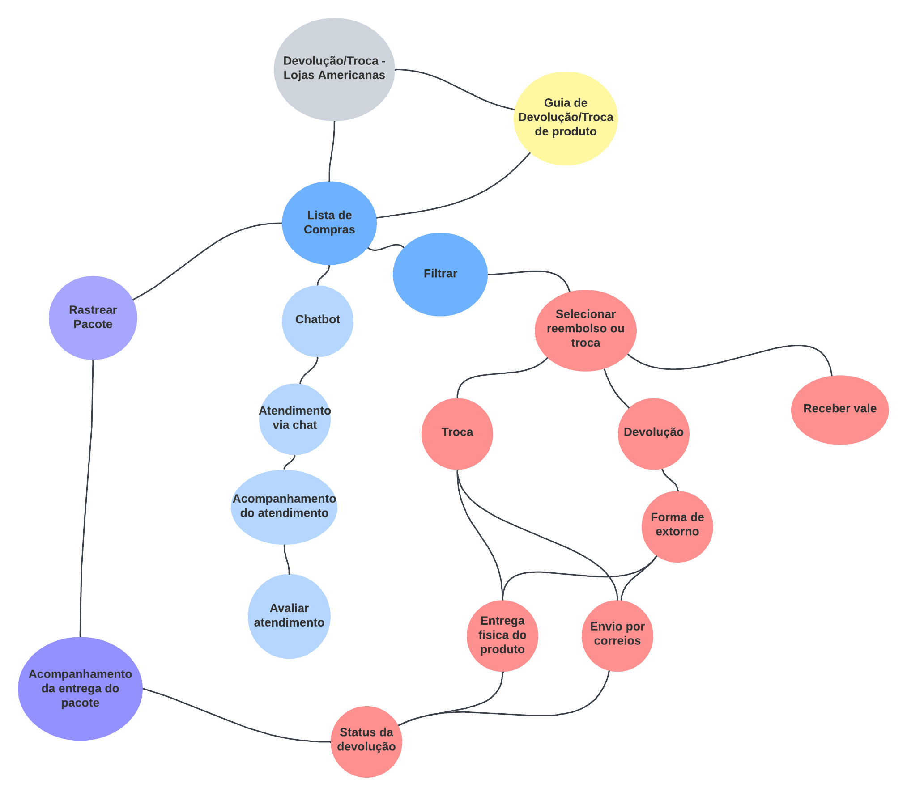
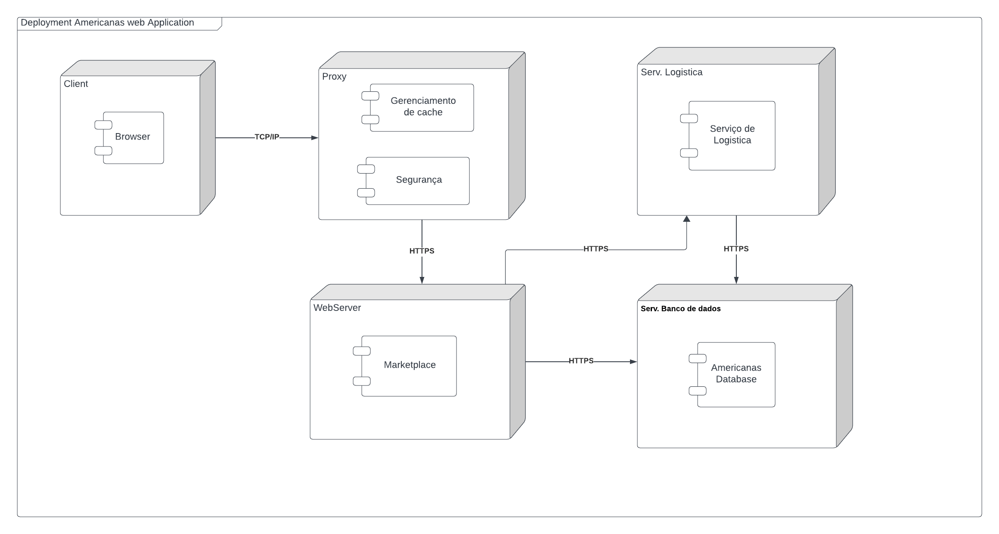
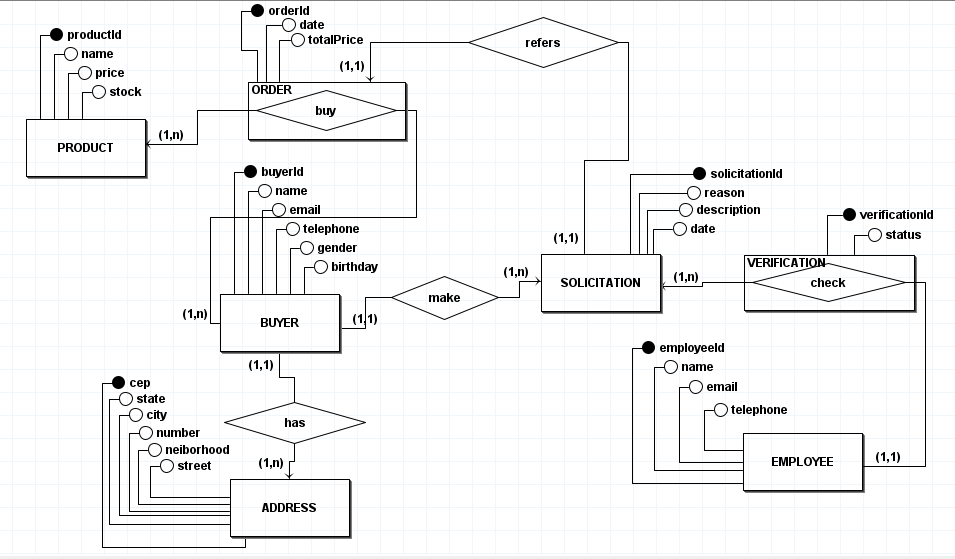
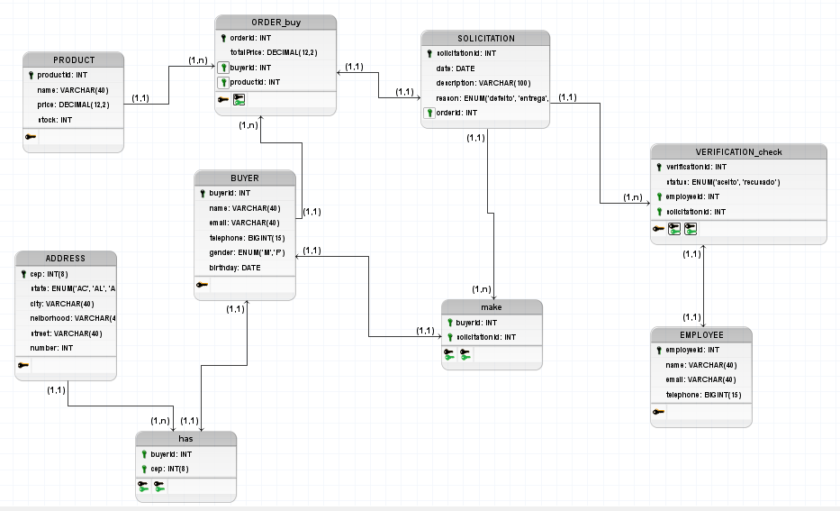

# Documento de Arquitetura de Software

&emsp;&emsp; Neste documento, exploramos nossa visão sobre a arquitetura de software no âmbito do processo de troca/devolução de produtos das Lojas Americanas, utilizando conceitos aprendidos durante o curso. Empregamos um modelo de arquitetura de software 4 + 1, ilustrado na figura abaixo, para proporcionar uma compreensão abrangente da arquitetura a todos os stakeholders. Além disso, abordamos uma variedade de requisitos, tanto funcionais quanto não-funcionais.

<figcaption align='center'>
    <b>Figura 1: Modelo 4 + 1</b>
</figcaption> 

## 1. Finalidade

&emsp;&emsp; O objetivo deste Documento de Arquitetura de Software (DAS) é apresentar uma visão abrangente da arquitetura do sistema de troca e devolução de produtos das Lojas Americanas. Nele, são detalhadas as decisões e orientações arquiteturais escolhidas para assegurar um design robusto, escalável e de fácil manutenção. Além disso, o DAS funciona como uma fonte de referência para a equipe de desenvolvimento e demais partes interessadas, contribuindo para manter a consistência e promover uma compreensão compartilhada da arquitetura do software.

### 1.1. Escopo 

&emsp;&emsp; Este Documento de Arquitetura de Software (DAS) aborda de maneira integral a estrutura do aplicativo destinado à Avaliação de Produtos no ambiente do Mercado Livre. Compreendem-se não apenas a configuração geral do sistema, mas também os elementos fundamentais que o compõem, as interfaces estabelecidas, os fluxos de informação, e as dinâmicas interativas entre os vários módulos do software.

A abordagem inicial escolhida foi a utilização do mapa mental para delinear o escopo do projeto. Nessa fase, a equipe é encorajada a conduzir uma sessão de brainstorming, destacando-se na identificação e listagem dos diversos aspectos associados ao sistema em desenvolvimento. Os integrantes do time têm a oportunidade de enriquecer o mapa mental com suas perspectivas e conhecimentos únicos, culminando na versão final apresentada abaixo.

#### [Mapa Mental](/Base/MapaMental.md)

<figcaption align='center'>
    <b>Figura 2: Mapa Mental</b>
     <small>Autor: Todos os integrantes</small>
</figcaption> 

### 1.2. Visão Geral
&emsp;&emsp; O documento oferece uma visão detalhada das decisões arquiteturais direcionadas ao fluxo de troca/devolução de produtos contemplando os perfis de plataforma e comprador. Essa abordagem compreende integralmente este fluxo do sistema, para tal, todos os artefatos desenvolvidos durante a disciplina de Arquitetura e Desenho de Software que forem necessários para contemplar como um todo as visões arquiteturais do DAS são incorporados ao documento, bem como elementos cruciais para a compreensão da arquitetura do sistema.

## 2. Representação da arquitetura

&emsp;&emsp; A seguir está listado quais os diagramas construídos ao longo do semestre serão, este documento conta com a representação visual de cada um desstes artefatos, acompanhada da ligação direta para os artefatos em si.

### 2.1 Diagrama de Sequência 

#### [Diagrama de Sequência](/Modelagem/DiagramaSequencia.md)

&emsp;&emsp;Um diagrama de sequência é uma representação visual que descreve a interação entre objetos em um sistema ao longo do tempo. Ele destaca a ordem específica das mensagens trocadas entre os objetos, mostrando como eles colaboram para realizar uma funcionalidade ou cenário específico. Os diagramas de sequência são frequentemente utilizados na modelagem de sistemas orientados a objetos para ilustrar o fluxo de execução das operações entre diferentes partes do sistema.

(insira aqui o diagrama de sequencias)

### 2.2 Diagrama de Classes

#### [Diagrama de Classe](/Modelagem/diagramaClasses.md)

&emsp;&emsp;Um diagrama de classes é uma representação visual que ilustra a estrutura estática de um sistema, mostrando as classes, seus atributos, métodos e os relacionamentos entre elas. Ele é uma ferramenta fundamental na modelagem orientada a objetos, permitindo a visualização das entidades do sistema e suas interações. 

Esses diagramas são valiosos para entender a estrutura do sistema, facilitando a comunicação entre membros da equipe e servindo como base para o desenvolvimento de software orientado a objetos.

(insira aqui o diagrama de classes)

### 2.3 Diagrama de Sequência

#### [Diagrama de Sequência](/Modelagem/DiagramaSequencia.md)

&emsp;&emsp;Um diagrama de sequência é uma representação visual que mostra a interação entre objetos em um sistema ao longo do tempo. Ele destaca a ordem das mensagens trocadas entre os objetos, revelando como diferentes partes do sistema colaboram para executar uma funcionalidade específica. Esses diagramas são úteis para compreender a lógica temporal das operações e interações em sistemas orientados a objetos.

(insira aqui o diagrama de sequencia)

### 2.4 Diagrama de Componentes

#### [Diagrama de Componentes](/docs/Modelagem/diagramaComponentes.md)

&emsp;&emsp;O diagrama de componentes é uma representação visual que ilustra a estrutura e as dependências entre os componentes de um sistema. Ele mostra como diferentes partes do software estão organizadas em termos de componentes e como esses componentes interagem uns com os outros. Esse tipo de diagrama é valioso para entender a modularidade, a reutilização e as dependências entre as partes de um sistema, facilitando a visualização da arquitetura geral do software.

(insira aqui o diagrama de componentes)

### 2.5 Diagrama de Sequência

#### [Diagrama de Sequência](/docs/Modelagem/DiagramaSequencia.md)

&emsp;&emsp;O diagrama de sequência é uma representação visual da interação entre objetos em um determinado cenário ou fluxo de execução. Ele destaca a ordem das mensagens trocadas entre os objetos ao longo do tempo, mostrando como as ações são realizadas e as relações entre os elementos. Esses diagramas são especialmente úteis para entender o comportamento dinâmico de um sistema, capturando o fluxo de controle e as trocas de informações entre os objetos durante uma operação específica.

(insira aqui o diagrama de sequencia)

### 2.6 Diagrama de Atividades

#### [Diagrama de Atividades](/docs/Modelagem/DiagramaSequencia.md)

&emsp;&emsp;O diagrama de atividades é uma representação visual que descreve o fluxo de trabalho ou o comportamento de um sistema. Ele é composto por diferentes elementos gráficos, como atividades, decisões, bifurcações, uniões e sincronizações, que ajudam a ilustrar o processo de execução de uma atividade ou tarefa específica. Esse tipo de diagrama é valioso para modelar o comportamento concorrente, a ordem de execução das atividades e as decisões tomadas durante o fluxo de trabalho, proporcionando uma visão clara e compreensível do sistema em questão.

(insira aqui o diagrama de atividades)

## 3. Objetivos e Restrições de Arquitetura 

&emsp;&emsp; Os objetivos arquiteturais representam as metas e diretrizes fundamentais que orientam o design e o desenvolvimento de um sistema de software. Essas metas visam atender aos requisitos funcionais e não funcionais, garantindo características como desempenho, escalabilidade, segurança e manutenibilidade. Ao estabelecer objetivos arquiteturais claros, os arquitetos de software buscam criar uma estrutura sólida e flexível que cumpra as expectativas do cliente, do usuário e da organização.

&emsp;&emsp; As restrições arquiteturais são condições e limitações impostas ao processo de design de software. Elas podem incluir restrições tecnológicas, orçamentárias, de prazos ou legais. As restrições guiam as escolhas arquiteturais ao impor certos parâmetros que devem ser respeitados durante o desenvolvimento do sistema. Enquanto os objetivos delineiam o que se pretende alcançar, as restrições definem os limites dentro dos quais o sistema deve ser concebido e implementado. O equilíbrio eficaz entre objetivos e restrições contribui para a criação de uma arquitetura robusta e alinhada com os requisitos e contextos específicos do projeto.

## 3.1. Importância dos Objetivos Arquiteturais

<strong> Direcionamento do Design:</strong>  Os objetivos arquiteturais servem como norteadores essenciais durante o processo de design, garantindo que as escolhas arquiteturais estejam alinhadas com as metas globais do sistema. Eles asseguram que a equipe de desenvolvimento concentre-se nas características mais críticas e valiosas para o sucesso do projeto.

<strong>Avaliação de Desempenho:</strong>  Ao estabelecer objetivos específicos relacionados ao desempenho, escalabilidade e eficiência, os arquitetos podem criar sistemas que atendam às expectativas de desempenho do usuário. Esses objetivos são fundamentais para garantir que o sistema seja capaz de lidar com a carga prevista e oferecer uma experiência eficiente.

<strong> Alinhamento com Requisitos do Cliente:</strong>  Os objetivos arquiteturais derivam, em grande parte, dos requisitos do cliente. Ao entender e incorporar esses objetivos, os arquitetos garantem que a solução proposta atenda às necessidades e expectativas do cliente, aumentando a satisfação e o valor percebido.

### 3.1.1. Escalabilidade:

&emsp;&emsp;Projetar a arquitetura de modo que o sistema possa lidar com picos de solicitações durante períodos de devoluções em massa, como após feriados ou grandes promoções.

### 3.1.2. Manutenibilidade:

&emsp;&emsp;Adotar uma arquitetura modular que permita a fácil modificação e expansão dos processos de troca e devolução conforme as políticas da empresa evoluem.

### 3.1.3. Desempenho

&emsp;&emsp;Otimizar a arquitetura para garantir que as consultas e atualizações relacionadas a trocas e devoluções sejam eficientes, minimizando o tempo de resposta.

### 3.1.4. Segurança

&emsp;&emsp;Implementar medidas robustas de segurança para proteger informações sensíveis, como detalhes de transações e dados pessoais dos clientes durante o processo de devolução.

### 3.1.5. Portabilidade

&emsp;&emsp;Projetar a arquitetura para funcionar de maneira consistente em várias plataformas e dispositivos, garantindo uma experiência de usuário uniforme.

## 3.2. Importância das Restrições Arquiteturais

<strong>Limites Claros para Tomada de Decisões:</strong> As restrições arquiteturais estabelecem limites realistas e tangíveis para o processo de design. Elas ajudam a equipe a evitar escolhas que podem ser impraticáveis ou inviáveis em termos de tecnologia, orçamento ou cronograma, proporcionando um guia claro para tomadas de decisão.

<strong>Gerenciamento de Recursos:</strong> Restrições orçamentárias, de tempo e de recursos são comuns em projetos de software. Estabelecer essas restrições desde o início ajuda a equipe a otimizar o uso dos recursos disponíveis, evitando desperdícios e atrasos.

<strong>Conformidade Legal e Normativa:</strong> Algumas restrições são impostas por requisitos legais ou normativos. Garantir a conformidade com essas restrições é vital para evitar problemas legais e assegurar que o sistema atenda aos padrões e regulamentações necessários.

### 3.2.1. Tecnologias Específicas
&emsp;&emsp;Utilizar uma tecnologia de banco de dados específica para armazenar e gerenciar eficientemente os registros de devoluções e trocas.

### 3.2.2. Orçamento e Recursos
&emsp;&emsp;Adotar soluções de arquitetura que se alinhem ao orçamento disponível para o projeto, considerando custos de desenvolvimento e manutenção.

### 3.2.3. Prazos de Entrega
&emsp;&emsp;Definir uma arquitetura que permita o desenvolvimento e implementação rápida do fluxo de troca e devolução, cumprindo os prazos estabelecidos pela empresa.

### 3.2.4. Compatilidade com Legados
&emsp;&emsp;Integrar o novo sistema de troca e devolução com o sistema existente de gerenciamento de pedidos, garantindo uma transição suave e consistência nas informações.

### 3.2.5. Conformidade Legal e Regulatória
&emsp;&emsp;Garantir que a arquitetura atenda a todas as regulamentações e leis relacionadas à privacidade do cliente, como o tratamento de dados pessoais durante o processo de devolução.

## 4. Visão Lógica

## 5. Visão de processo

## 6. Visão de implementação

## 7. Visão de implantação

Um diagrama de implantação é um tipo de diagrama UML (Unified Modeling Language) que representa a disposição física de elementos de um sistema em hardware. Ele mostra como os vários componentes de software, como aplicativos, servidores e dispositivos de armazenamento, estão distribuídos em diferentes nós de hardware, como computadores físicos ou máquinas virtuais.
Este documento apresenta a arquitetura de implantação de um sistema distribuído, focado em eficiência, segurança e escalabilidade. O sistema é estruturado em vários nós principais: Cliente, Proxy, Web Server e Database, cada um com componentes e entidades específicas.

### 7.1 Nó Cliente 
 - Componentes:
  - Browser: Interface de usuário para acesso ao sistema.
- Comunicação:
  - Estabelece uma conexão TCP/IP com o nó Proxy.

### 7.2 Nó Proxy
- Componentes:
  - Gerenciamento de Cache:
    - Entidade Cache: Responsável por armazenar dados frequentemente acessados, melhorando a resposta do sistema.
  - Segurança:
    - Entidade Filtro de Navegação: Filtra requisições para segurança do sistema.
  - Comunicação:
    - Conecta-se ao Web Server via HTTPS.

### 7.3 Nó Web Server
- Componentes:
    - Marketplace: Aplicação web da americanas.
- Comunicação:
    - Conecta-se ao Servidor de banco de dados via HTTPS
    - Conecta-se ao servidor de Logistica via HTTPS
### 7.4 Nó Servidor Logistica
- Componentes:
    - Serviço de logistica: Responsavel por fazer todo o tramite de logistica 
- Comunicação:
    - Conecta-se ao Servidor de banco de dados via HTTPS   

### 7.5 Nó Database
- Componentes:
  - Americanas Database: Responsável pelo armazenamento e gerenciamento de dados.

### Conclusão
Este sistema apresenta uma arquitetura robusta e segura, com ênfase em eficiência de processamento, segurança da informação e privacidade do usuário. Cada nó e componente é estrategicamente posicionado para otimizar a performance, segurança e escalabilidade do sistema.

## 8. Visão de dados

A visão de Dados se concentra na estrutura e organização dos dados persistentes utilizados pelo sistema. Ela descreve como os dados são armazenados, acessados e manipulados, incluindo as entidades de dados, seus atributos e relacionamentos.

### ME-R (Modelo Entidade-Relacionamento)

#### ENTIDADES

	USER
	ORDER
	PRODUCT
	SOLICITATION
	EMPLOYEE

#### ATRIBUTOS

	USER (userId, name, email, telephone, gender, birthday)
	ORDER (orderId, date, totalPrice)
	PRODUCT (productId, name, price, stock)
	SOLICITATION (solicitationId, reason, description, date)
	EMPLOYEE (employeeId, name, email, telephone)
    ADDRESS (cep, state, city, number, neiborhood, street)
    VERIFICATION (verificationId, status)

#### RELACIONAMENTOS

    USER -  has – ADDRESS
        One USER can have one or more ADDRESS, and a ADDRESS can belong to one USER.
    Cardinalidade: (1:n)

    USER – buy – PRODUCT
        One USER can buy one or more PRODUCTs, and a PRODUCT can be bought by one or more USERs.
    Cardinalidade: (n:m)

    USER – make – SOLICITATION
        One USER can make one or more SOLICITATIONs, and a SOLICITATION can be maked by one USER.
    Cardinalidade: (1:n)

    EMPLOYEE – check – SOLICITATION
        An EMPLOYEE can check one or more SOLICITATIONs, and a SOLICITATION can be checked by one EMPLOYEE.
    Cardinalidade: (1:n)

    SOLICITATION – refers – ORDER
        A SOLICITATION can referes to one ORDER, and an ORDER can be refered to a SOLICITATION.
    Cardinalidade: (1:1)

### DE-R (Diagrama Entidade-Relacionamento)

### DLD (Diagrama Lógico de Dados)

## 10.(ou 9) Referências

    (precisa referenciar direito)

    (referenciar material da professora)

    
    
    "Software Engineering: A Practitioner's Approach" por Roger S. Pressman.

    "Documenting Software Architectures: Views and Beyond" por Paul Clements, Felix Bachmann, Len Bass, David Garlan, James Ivers, Reed Little e Paulo Merson.

    Papers e documentação oficial da OMG (Object Management Group) para padrões UML, incluindo diagramas como Diagrama de Sequência, Diagrama de Classes, Diagrama de Atividades e outros.

    "Documenting Software Architectures: Views and Beyond" - Paul Clements, Felix Bachmann, Len Bass, David Garlan, James Ivers, Reed Little, Paulo Merson, Robert Nord, Judith Stafford

    "Software Systems Architecture: Working With Stakeholders Using Viewpoints and Perspectives" - Nick Rozanski, Eóin Woods

## Versionamento

| Versão | Alteração            | Responsável    | Revisor | Data de realização | Data de revisão |
| ------ | -------------------- | -------------- | ------- | ------------------ | --------------- |
| 1.0    | Criação do documento | Carlos Eduardo |   Matheus Costa    | 30/11   | 30/11          |
| 1.1    | Adição da visão de dados | Bruno Seiji |      | 01/12   |          |
| 1.2    | Adição do diagrama de implantação | Gabriel Ribeiro |   --   | 01/12/2023   | ---         |