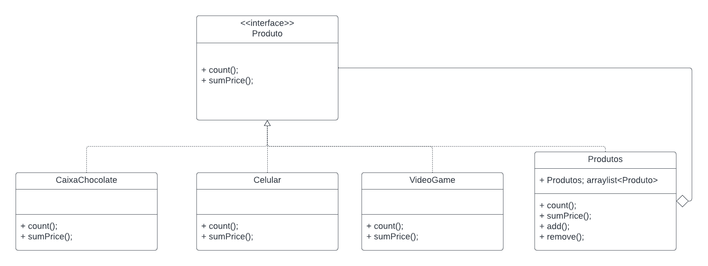

# Módulo de reutilização de software

## 1. Introdução

&emsp;&emsp;A reutilização de software consiste em aproveitar conceitos, produtos ou soluções existentes para criar novos softwares, com o objetivo de aprimorar a qualidade e a produtividade. Esse processo envolve a utilização de partes de sistemas anteriores, tais como especificações, módulos, arquitetura e código-fonte. A reutilização tem como meta principal elevar a qualidade e reduzir o tempo de desenvolvimento. Pode ser aplicada em diferentes etapas do ciclo de desenvolvimento, como requisitos, design e implementação. Atualmente, há várias técnicas de reuso disponíveis, tais como o uso de frameworks, a adoção de arquiteturas orientadas a serviços (SOA) e a prática de engenharia de software baseada em componentes.

## 2. Backend

### 2.1 Seleciona Item e quantidade - Composite
### A implemtação completa pode ser encontrada em [ Composite](/PadroesDeProjeto/Composite/Composite.md)


#### 2.1.1 - Análise de HotsSpots e FrozenSpots

Uma breve introdução dos termos, Hotspots são áreas de um software que são mais propensas a mudanças, normalmente apresentando alta complexidade e alto acoplamento. Essas áreas estão sujeitas a alterações frequentes devido a requisitos em constante evolução, mudanças no ambiente ou outros fatores. Identificar hotspots é importante para direcionar esforços de manutenção e refatoração para as áreas mais críticas do sistema. Já FrozenSpots são áreas de baixo acoplamento e baixa complexidade, são areas do software que raramente mudam.


<h6 align = "center">Figura 1: Diagrama Composite. Fonte: Gabriel Ribeiro</h6>

No contexto do Composite, a interface Produto, representa um **hotspot** porque é respoonsavel por fornecer a hierarquia na qual as "folhas" irão receber. Ou seja, se houver evolução nos requisitos assim como mudanças na regra de negócio, a interface sofreria mudanças acarretando em todas as suas classes da hierarquia. 
```
import Component.Produto;
import Composta.Produtos;
import Model.*;

public class Main {
    public static void main (String[] args){
        Produtos produtos = new Produtos();
        Produto caixaChocolate = new CaixaChocolate();
        Produto videoGame = new VideoGame();
        Produto celular = new Celular();
        produtos.add(caixaChocolate);
        produtos.add(videoGame);
        produtos.add(celular);
        produtos.count();
        produtos.sumPrice();
        System.out.println("-------------------removing-------------------");
        produtos.remove(videoGame);
        produtos.count();
        produtos.sumPrice();
    }
}
```

## Versionamento

| Versão | Alteração            | Responsável    | Revisor | Data de realização | Data de revisão |
| ------ | -------------------- | -------------- | ------- | ------------------ | --------------- |
|  1.0   | Criando documento e adição do Composite| Gabriel Ribeiro | Carlos Rafael | 30/11/2023 | 30/11/2023 |
