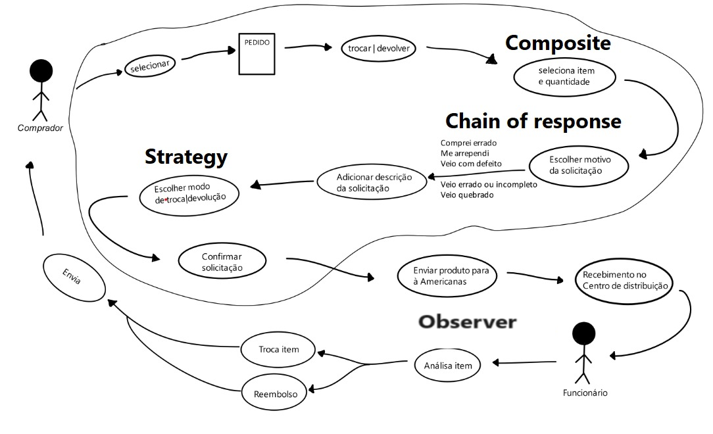
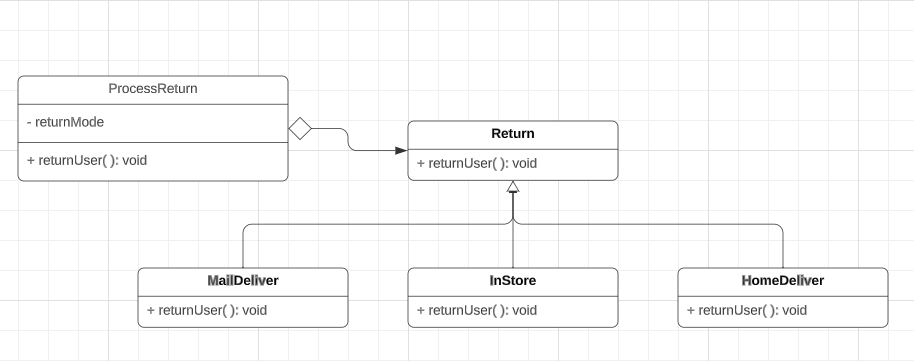

# Módulo de reutilização de software

## 1. Introdução

&emsp;&emsp;A reutilização de software consiste em aproveitar conceitos, produtos ou soluções existentes para criar novos softwares, com o objetivo de aprimorar a qualidade e a produtividade. Esse processo envolve a utilização de partes de sistemas anteriores, tais como especificações, módulos, arquitetura e código-fonte. A reutilização tem como meta principal elevar a qualidade e reduzir o tempo de desenvolvimento. Pode ser aplicada em diferentes etapas do ciclo de desenvolvimento, como requisitos, design e implementação. Atualmente, há várias técnicas de reuso disponíveis, tais como o uso de frameworks, a adoção de arquiteturas orientadas a serviços (SOA) e a prática de engenharia de software baseada em componentes.

&emsp;&emsp; Para um melhor resultado desse modulo, foi realizado em cima do nosso rich picture, um brainstorm com os membros do grupo para uma melhor visualização dos padrões de projeto. Como resultado, ficou acordado o uso de 4 Padrões para o nosso fluxo de Devolução/Troca, que foram: Composite, Chain of Responsability e o Strategy em duas oportunidades.



<h6 align = "center">Figura 1: Diagrama Composite. Fonte: todos</h6>

## 2. Backend

### 2.1 Seleciona Item e quantidade - Composite

Obs: A implementação completa pode ser encontrada em [Composite](/PadroesDeProjeto/Composite/Composite.md)

#### 2.1.1 - Análise de HotsSpots e FrozenSpots

Uma breve introdução dos termos, Hotspots são áreas de um software que são mais propensas a mudanças, normalmente apresentando alta complexidade e alto acoplamento. Essas áreas estão sujeitas a alterações frequentes devido a requisitos em constante evolução, mudanças no ambiente ou outros fatores. Identificar hotspots é importante para direcionar esforços de manutenção e refatoração para as áreas mais críticas do sistema. Já FrozenSpots são áreas de baixo acoplamento e baixa complexidade, são areas do software que raramente mudam.


<h6 align = "center">Figura 2: Diagrama Composite. Fonte: Gabriel Ribeiro</h6>

No contexto do Composite, a interface Produto, representa um **hotspot** porque é respoonsavel por fornecer a hierarquia na qual as "folhas" irão receber. Ou seja, se houver evolução nos requisitos assim como mudanças na regra de negócio, a interface sofreria mudanças acarretando em todas as suas classes da hierarquia.

```
import Component.Produto;
import Composta.Produtos;
import Model.*;

public class Main {
    public static void main (String[] args){
        Produtos produtos = new Produtos();
        Produto caixaChocolate = new CaixaChocolate();
        Produto videoGame = new VideoGame();
        Produto celular = new Celular();
        produtos.add(caixaChocolate);
        produtos.add(videoGame);
        produtos.add(celular);
        produtos.count();
        produtos.sumPrice();
        System.out.println("-------------------removing-------------------");
        produtos.remove(videoGame);
        produtos.count();
        produtos.sumPrice();
    }
}
```

## 2.2. Chain Of Responsibility

Obs: A implementação completa pode ser encontrada em [Chain Of Responsibility](/PadroesDeProjeto/ChainOfResponsibility.md)

Durante a etapa de construção dos padrões de projeto, foi construido o padrão comportamental Chain of Responsability, pois O padrão permite que você construa uma cadeia de manipuladores onde cada manipulador tem a oportunidade de lidar com uma solicitação ou passá-la para o próximo manipulador na cadeia. Isso proporciona flexibilidade e desacoplamento, permitindo que diferentes manipuladores possam tratar diferentes tipos de solicitações. O que atendia perfeitamente a etapa do fluxo de escolha o motivo da solicitação, pois a partir dessa escolha, seria atribuido aos departamentos, a responsabilidade por aquele produto


<h6 align = "center">Figura 3: Diagrama Chain. Fonte: Alex Gabriel</h6>

## 2.3. Observer

Obs: A implementação completa pode ser encontrada em [Observer](/PadroesDeProjeto/Observer.md)

Durante a etapa de construção dos padrões de projeto, foi construido o padrão comportamental Observer, pois com o Principio aberto/fechado você pode introduzir novas classes assinantes sem ter que mudar o código da publicadora e também estabelecer relações entre objetos durante a execução. O que se encaixa na etapa do nosso fluxo de
analise do produto para a confirmação do da troca/reembolso.


<h6 align = "center">Figura 4: Diagrama Observer. Fonte: Carlos Rafael</h6>

## 2.4. Strategy

Obs: A implementação completa pode ser encontrada em [Strategy](/PadroesDeProjeto/Strategy/Strategy.md)

Durante a etapa da construção dos padrões de projeto, foi cosntruido o padrão compartamental Strategy, pois com o Princípio aberto/fechado, você pode introduzir novas estratégias sem mudar o contexto e também isolar os detalhes de implementação de um algoritmo do código que usa ele. O que se encaixa para duas etapas do nosso fluxo, na escolha do modo de devolução, e na forma de como será feito o reembolso em caso de devolução.



<h6 align = "center">Figura 5: Diagrama Strategy Escolha do modo de devolução. Fonte: Bruno Seiji</h6>


<h6 align = "center">Figura 6: Diagrama Strategy Reembolso. Fonte: Guilherme Peixoto</h6>

## Versionamento

| Versão | Alteração                               | Responsável     | Revisor       | Data de realização | Data de revisão |
| ------ | --------------------------------------- | --------------- | ------------- | ------------------ | --------------- |
| 1.0    | Criando documento e adição do Composite | Gabriel Ribeiro | Carlos Rafael | 30/11/2023         | 30/11/2023      |
| 2.0    | Adição dos demais Padrões               | Gabriel Ribeiro | Carlos Rafael | 30/11/2023         | 01/12/2023      |
| 2.1    | Correções de links     | Matheus Costa | Carlos Rafael | 04/12/2023       | 04/12/2023      |
