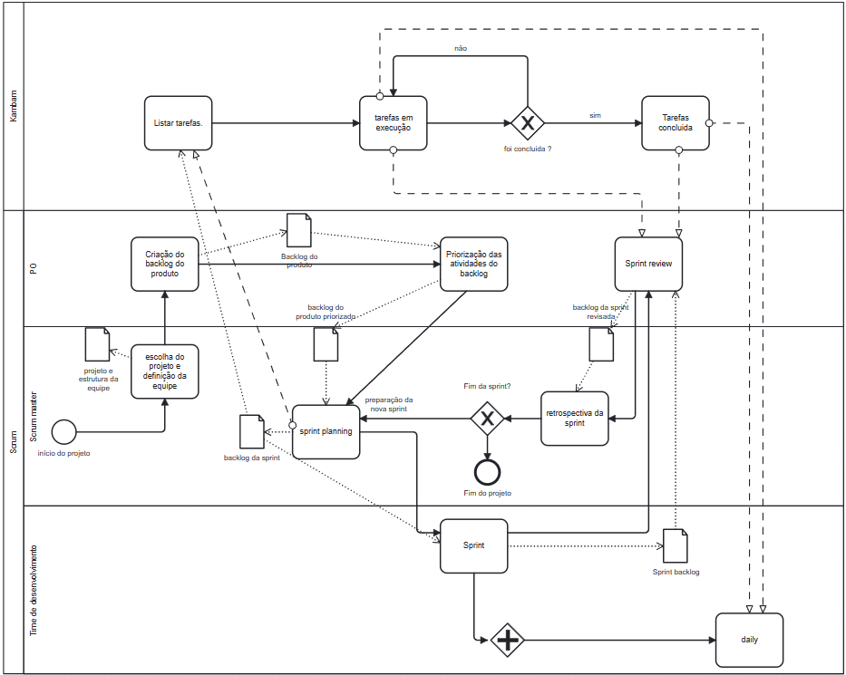
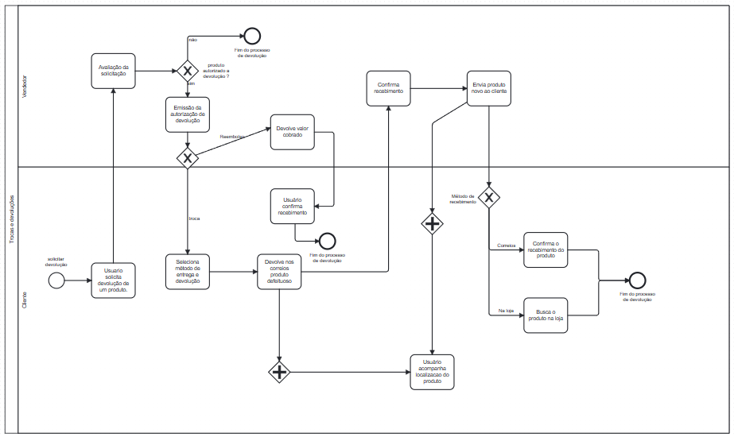

# Processos/Metodologias/Abordagens

## 1. Introdução e objetivo

A modelagem de processos é a representação gráfica dos processos de uma empresa. Fazer essa diagramação é muito importante porque permite a leitura do funcionamento da empresa e o entendimento de como a organização gera valor aos clientes. Para facilitar a modelagem de processos é possível contar com um conjunto padronizado de símbolos e regras, e o mais indicado deles é a Notação BPMN.

## 2. Metodologia

As metodologias ágeis de trabalho são essenciais para o desenvolvimento de um produto que se adapta as mudanças de mercado. Elas ainda trazem consigo uma promoção do trabalho colaborativo constante, fazendo que o material humano seja extraído ao máximo sem desperdícios. As abordagens e processos se diferenciam pela sua flexibilidade e rigor, e no cenário que é evidente a necessidade de seguir um processo de desenvovilmento estruturado, a equipe analisou o que melhor se encaixa no perfil coletivo dos integrantes. Diante disso, nossas escolhas se pautaram nessses conceitos.

### 2.1. Metodologias escolhidas

- #### Scrum

  O Scrum é um método ágil para desenvolver projetos em etapas curtas chamadas "sprints". Em cada sprint, a equipe define metas e trabalha por 2 a 4 semanas. Eles têm reuniões diárias, revisam o progresso e ajustam o planejamento. O Scrum promove colaboração e adaptação rápida, usando uma lista de tarefas chamada "backlog". Isso ajuda as equipes a criar produtos incrementais e se ajustar às mudanças de forma eficaz.

  Há 3 papeis fundamenteis para o pleno funcionamento dessa metodologia:

  - **Scrum Master** (Facilitador e líder da equipe)
  - **Product Owner** (Representante dos interesses do cliente/usuário)
  - **Scrum Team** (desenvolvedores, testadores etc...)

  E 3 artefatos:

  - **Product Backlog** (Lista priorizada das funcionalidades, requisitos e tarefas para o desenvolvimento do produto)
  - **Sprint Backlog** (itens selecionados do Product Backlog para a sprint)
  - **Gráfico de Burndown** (ferramenta de acompanhamento do progresso da equipe na sprint)

- #### Kanban

  O Kanban é uma abordagem simples de ser implementada mas que tem grande valor dentro do gerencimaneto do fluxo de desenvolvimento. Ele conta com um quadro(ou painel) onde as tarefas são representadas como cartões movidos de uma coluna para outra, os cartões são: **" a fazer "**, **" fazendo "**, **" feito "**

### 2.2. Motivação dessas escolhas

A decisão de adotar essas práticas tem suas raízes em diversos fatores que consideramos cruciais para o sucesso do nosso projeto. Abaixo, apresentamos nossas justificativas:

- **Experiência Prévia:** Vários membros da nossa equipe já possuem experiência anterior com o Scrum e o Kanban em seus ambientes de trabalho ou em projetos acadêmicos anteriores. Isso nos fornece uma base sólida para implementar essas metodologias de maneira eficaz.

- **Flexibilidade do Kanban:** Optamos por integrar o Kanban com o Scrum para aproveitar a flexibilidade que o Kanban oferece na gestão do fluxo de trabalho. Isso nos permite visualizar e otimizar a nossa produção de forma contínua, adaptando-nos às mudanças e ajustando as prioridades conforme necessário.

- **Transparência e Comunicação:** O Scrum promove a transparência e a comunicação eficaz dentro da equipe. Através de reuniões regulares, como o Daily Scrum, estaremos atualizados sobre o progresso de cada membro e qualquer impedimento que possa surgir, permitindo a rápida resolução de problemas.

- **Sprint Planning e Entregas Incrementais:** A abordagem Scrum nos ajuda a planejar sprints com metas claras e alcançáveis. Com entregas incrementais ao final de cada sprint, teremos a oportunidade de receber feedback constante e realizar ajustes, se necessário.

Entretanto, nós, como equipe, optamos por ainda tornar a metodologia mais flexível, pois, devido a choque de horários e tempo escasso por parte dos integrantes da equipe, alguns artefatos da metodologia não são possíveis de serem implementados, como por exemplo, as reunições diárias, o que não quer dizer que a comunicação não será feita todos os dias, apenas que o momento em que todos estrão pareados simultaneamente não acontecerá. Desse modo, a utilização da metodologia ágil Scrum e a ferramenta de fluxo de trabalho Kanban são apenar norteadores do processo colaborativo e não regras absolutas.

## 3. BPMN

Com a definição das metodologia e ferramentas de trabalho, é visado a criação do **BPMN** que é o diagrama que modela os processos de negócio do produto, nele contém um fluxograma que contém cada etapa dentro do processo.

Para a construção do fluxograma, utilizamos como ponto de início a escolha do projeto e a definição da equipe. Separamos cada etapa do fluxo em piscinas para especificar quais partes do processo pertecem a qual entidade do desenvolvimento.

Além disso, também demonstraremos o fluxo de trocas e devoluções por meio da modelagem BPMN.

Ferramenta:
Para desenvolvimento do BPMN foi utilizado o Modeler.

### BPMN - Metodologia

### BPMN - Fluxo de Trocas e Devoluções

Descreve o fluxo que o usuário deve seguir para realizar a uma tarefa no site.

## Versionamento

| Versão |        Alteração         |     Responsável     |       Revisor       | Data de realização | Data de revisão |
| :----: | :----------------------: | :-----------------: | :-----------------: | :----------------: | :-------------: |
|  1.0   |    Criando documento     |   Guilherme Lima    | Bruno Seiji Kishibe |       14/09        |      14/09      |
|  1.1   | Adicionando imagens BPMN | Bruno Seiji Kishibe |   Guilherme Lima    |       14/09        |      14/09      |
