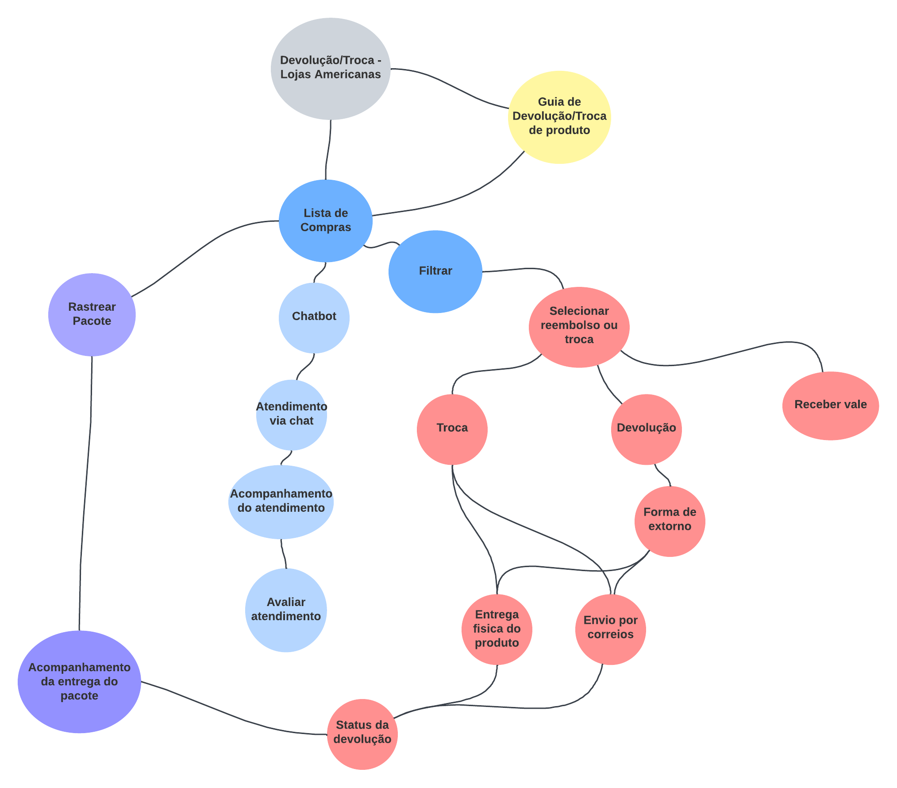

# Mapa Mental

## Introdução

O Mapa Mental é uma técnica que propõe organizar pensamentos lógicos com o objetivo de facilitar o entendimento e a conexão de conceitos. Geralmente, possui uma ideia central que vai se ramificando em subtemas relacionados, tornando-se um bom artefato de visualização e consolidação de informações.

## Participantes

- Carlos Eduardo
- Carlos Rafael
- Pedro Victor

## Mapa Mental

## Versionamento

| Versão |     Alteração     |  Responsável  | Revisor | Data  |
| :----: | :---------------: | :-----------: | :-----: | :---: |
|  1.0   | Criando documento | Carlos Rafael |    -    | 14/09 |
