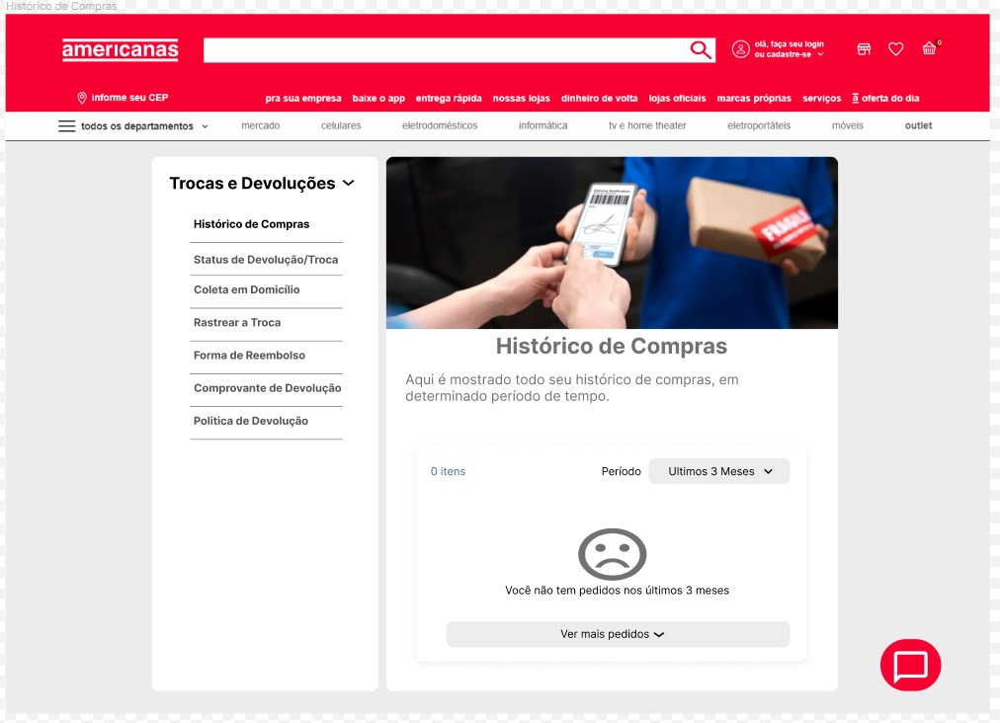
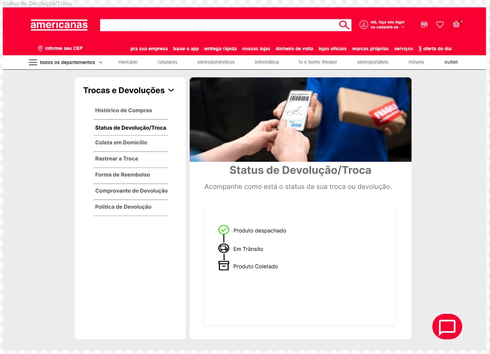
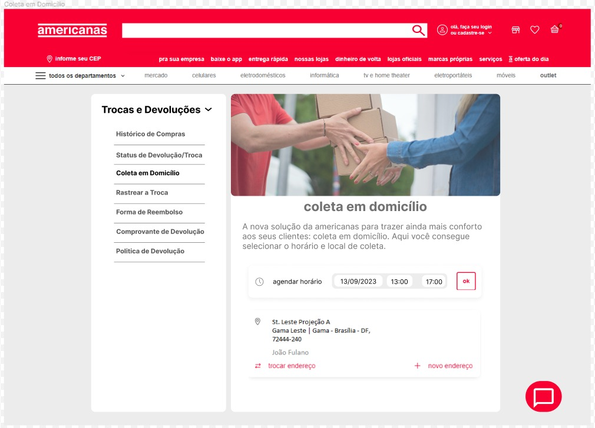
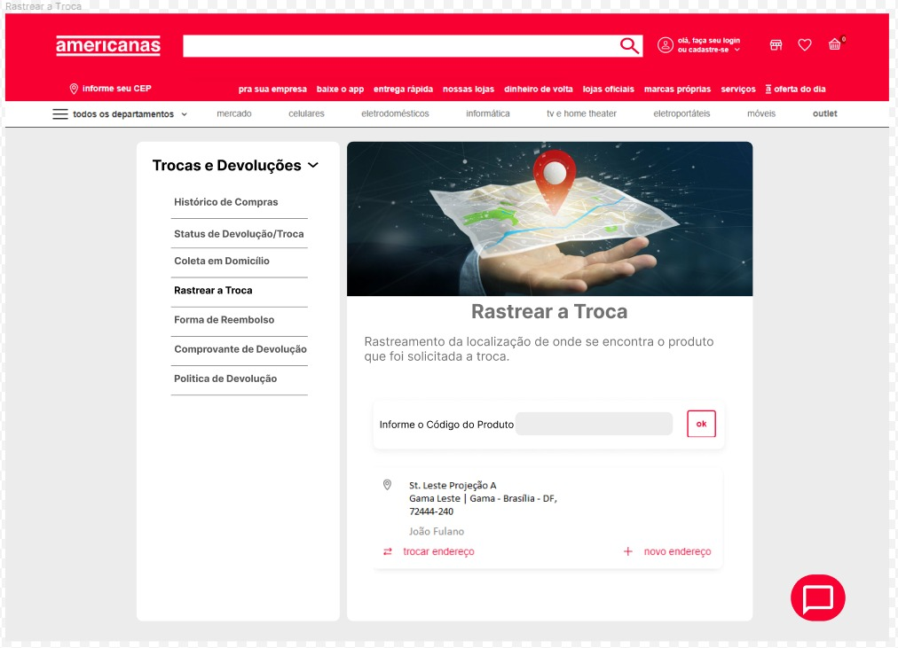

# Protótipo

## Introdução

O Protótipo é uma técnica que serve como uma primeira versão de um produto, para que os responsáveis pelo desenvolvimento do produto tenham uma base de como será o produto.

## Participantes

- Guilherme Brito
- Matheus Raphael

## Protótipo

## Versionamento

| Versão |     Alteração     |  Responsável  | Revisor | Data de realização | Data de revisão 
| :----: | :---------------: | :-----------: | :-----: | :---: | :----:
|  1.0   | Criando documento | Guilherme Brito | Matheus Costa | 14/09 | 14/09
