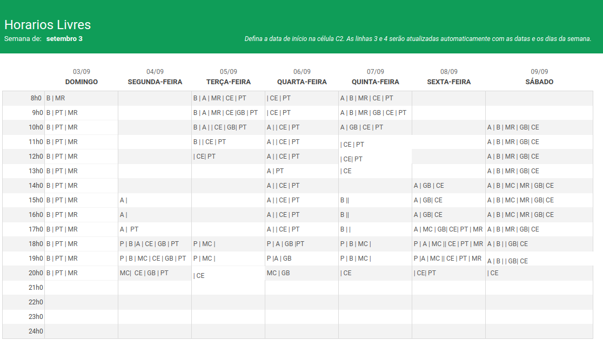

# Conferências

Para estabelecermos os horários para nossas reuniões de planejamento de cada sprint, elaboramos um mapa de calor a fim de identificar os momentos da semana nos quais a maioria ou todos os membros da equipe estivessem disponíveis. Segue, então, o referido mapa:

## Reuniões

Com o mapa de calor devidamente preenchido, é possível constatar que as segundas e sextas-feiras, das 18h às 20h, emergem como os horários mais propícios para agendarmos nossas reuniões, e, de certo modo, seguiremos esse princípio.

É importante ressaltar que isso não implica necessariamente que todas as reuniões serão agendadas sistematicamente nos mesmos dias da semana e horários. Nossa metodologia de trabalho é profundamente flexível em todos os aspectos, de modo a adaptar-se de forma mais eficaz às particularidades de nossos colaboradores.

### Histórico de versionamento

| Versão | Alteração            | Responsável    | Revisor | Data de realização | Data de revisão |
| ------ | -------------------- | -------------- | ------- | ------------------ | --------------- |
| 1.0    | Criação do documento | Carlos Eduardo |         | 27/09              |                 |
