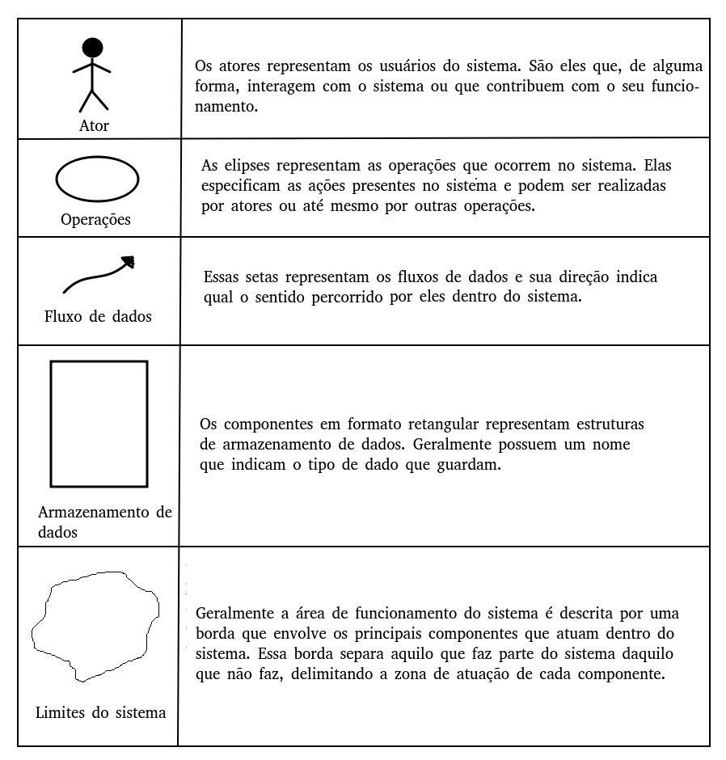
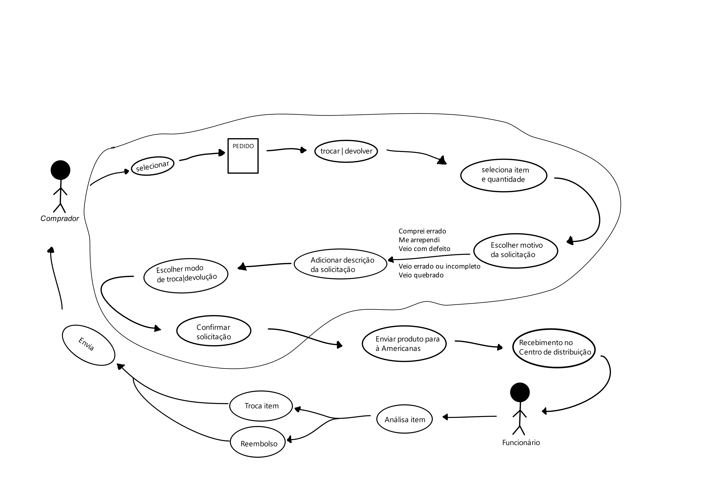
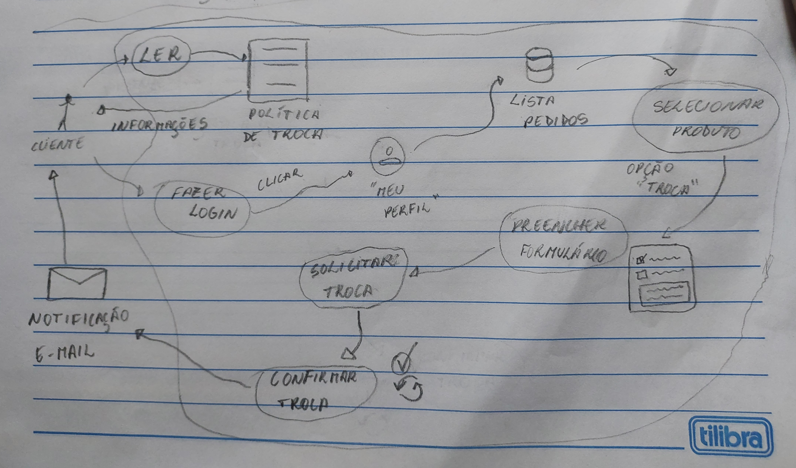
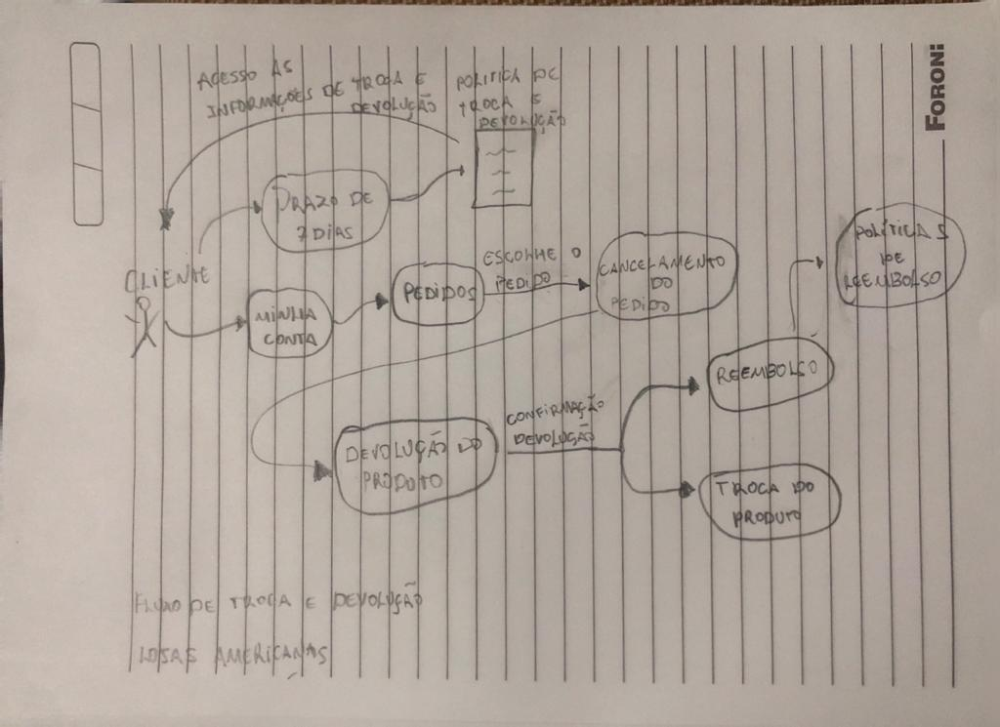

# Rich Picture

## Introdução

O Rich Picture é uma representação visual poderosa que oferece uma visão abrangente e integrada de um projeto. Ele combina elementos gráficos e texto para capturar de forma eficaz os principais aspectos e interações envolvidos.

Neste documento, exploraremos o Rich Picture aplicado no contexto do site das Lojas Americanas, apresentando sua finalidade, objetivos e a abordagem metodológica adotada, com foco no fluxo de Trocas e Devoluções pelo site.

## Objetivo

O objetivo do Rich Picture é proporcionar uma compreensão global e compartilhada de todas as partes interessadas. Ele busca:

- Facilitar a comunicação entre equipes e partes interessadas.
- Identificar relações e interações complexas entre os elementos do projeto.
- Fornecer uma base visual para orientar a implementação e tomada de decisões.

## Metodologia

Para desenvolver o Rich Picture, será seguida uma abordagem que envolve coletar informações sobre a Política de Troca e Devoluções, adotada pela empresa de varejo Lojas Americanas, nas compras online e o fluxo de usuário ao realizar essas tarefas.

## Legendas

Abaixo, uma figura com os símbolos e suas respectivas descrições. Esses símbolos foram utilizados na criação dos Rich Pictures desenvolvidos pelo grupo.

    

<h6 align = "center">Figura 1: legenda do rich picture</h6>

## Rich Picture

Inicialmente, foram desenvolvidas algumas versões de Rich Picture por integrantes da equipe. Essas versões refletem como cada integrante que desenvolveu um Rich Picture, interpretou o fluxo de maneira pessoal, em um primeiro momento.

Abaixo são mostradas as versões desenvolvidas.

#### Alex Gabriel - v0.1

<h6 align = "center">Figura 2: rich picture Alex - fluxo de trocas e devoluções</h6>

#### Matheus Costa - v0.2

<h6 align = "center">Figura 3: rich picture Matheus</h6>

#### Gabriel de Souza - v0.2

<h6 align = "center">Figura 4: rich picture Gabriel</h6>

## Referências bibliográficas

> MULTI-STAKEHOLDER PARTNERSHIPS. **Rich Picture**. Disponível em: <a href="https://mspguide.org/2022/03/18/rich-picture/." target="__blank">https://mspguide.org/2022/03/18/rich-picture/.</a> **Acesso em:** 12 set. 2023.

## Versionamento

| Versão | Data da realização | Data prevista revisão | Descrição                        | Autor            | Revisor       |
| ------ | ------------------ | --------------------- | -------------------------------- | ---------------- | ------------- |
| 1.0    | 12/09/2023         | 14/09/2023            | criação do artefato Rich Picture | Alex Gabriel     | Matheus Costa |
| 1.1    | 14/09/2023         | 14/09/2023            | adição de segundo Rich Picture   | Matheus Costa    | Gabriel Souza |
| 1.2    | 14/09/2023         | 14/09/2023            | adição de terceiro Rich Picture  | Gabriel de Souza | Matheus Costa |
