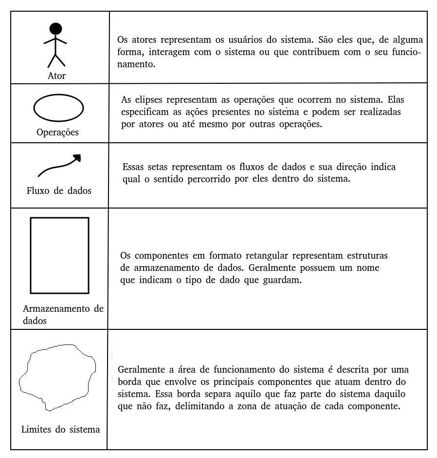
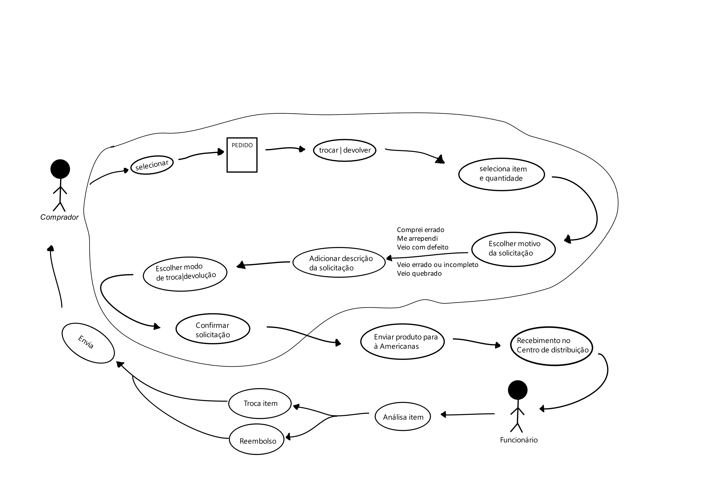

# Rich Picture
## Introdução

O Rich Picture é uma representação visual poderosa que oferece uma visão abrangente e integrada de um projeto. Ele combina elementos gráficos e texto para capturar de forma eficaz os principais aspectos e interações envolvidos.

Neste documento, exploraremos o Rich Picture aplicado ao site das lojas americanas, apresentando sua finalidade, objetivos e a abordagem metodológica adotada, com foco no fluxo de trocas e devoluções do site.

## Objetivo

O objetivo do Rich Picture é proporcionar uma compreensão global e compartilhada de todas as partes interessadas. Ele busca:

- Facilitar a comunicação entre equipes e partes interessadas.
- Identificar relações e interações complexas entre os elementos do projeto.
- Fornecer uma base visual para orientar a implementação e tomada de decisões.

## Metodologia

Para desenvolver o Rich Picture, será seguida uma abordagem que envolve coletar informações sobre a politica de troca e devoluções adotadas pelas lojas americanas em compras online e o fluxo de usuário ao realizar essas tarefas. 

## Legendas
Abaixo a figura com os simbolos e suas respectivas descrições, esses simbolos foram utilizados na criação do Rich Picture.

    

<h6 align = "center">Figura 1: legenda do rich picture</h6>

## Rich-picture

    

<h6 align = "center">Figura 2: rich picture fluxo de trocas e devoluções</h6>

## Referências bibliográficas
> MULTI-STAKEHOLDER PARTNERSHIPS. **Rich Picture**. Disponível em: <a href="https://mspguide.org/2022/03/18/rich-picture/." target="__blank">https://mspguide.org/2022/03/18/rich-picture/.</a> **Acesso em:** 12 set. 2023.

## Versionamento

| Versão | Data da realização | Data prevista revisão | Descrição | Autor | Revisor |
|--------|------|------|-----------|-------|---------|
| 1.0    | 12/09/2023 | 14/09/2023| criação do artefato rich-picture | Alex Gabriel |a definir|