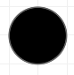
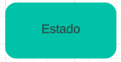
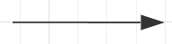
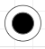
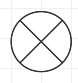
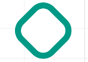
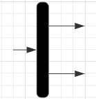
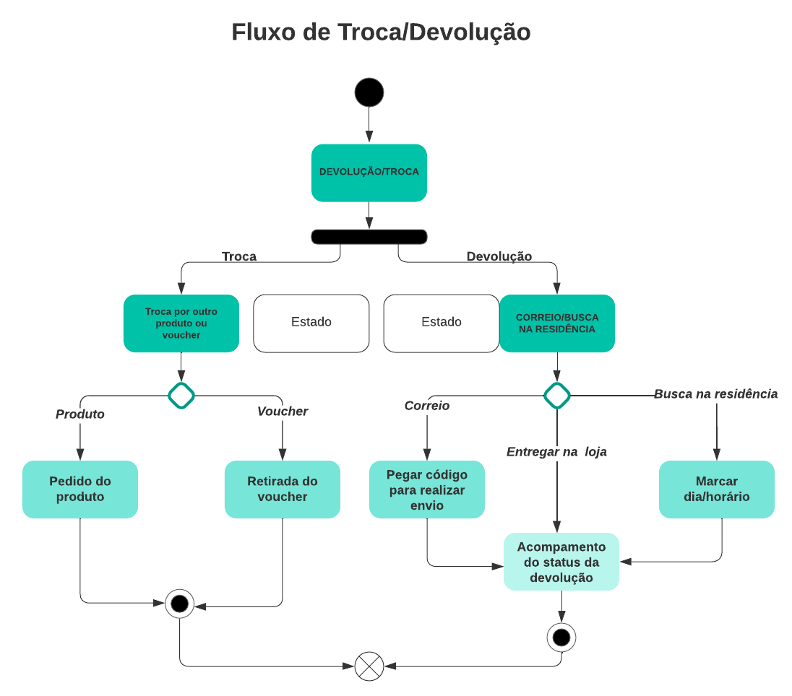
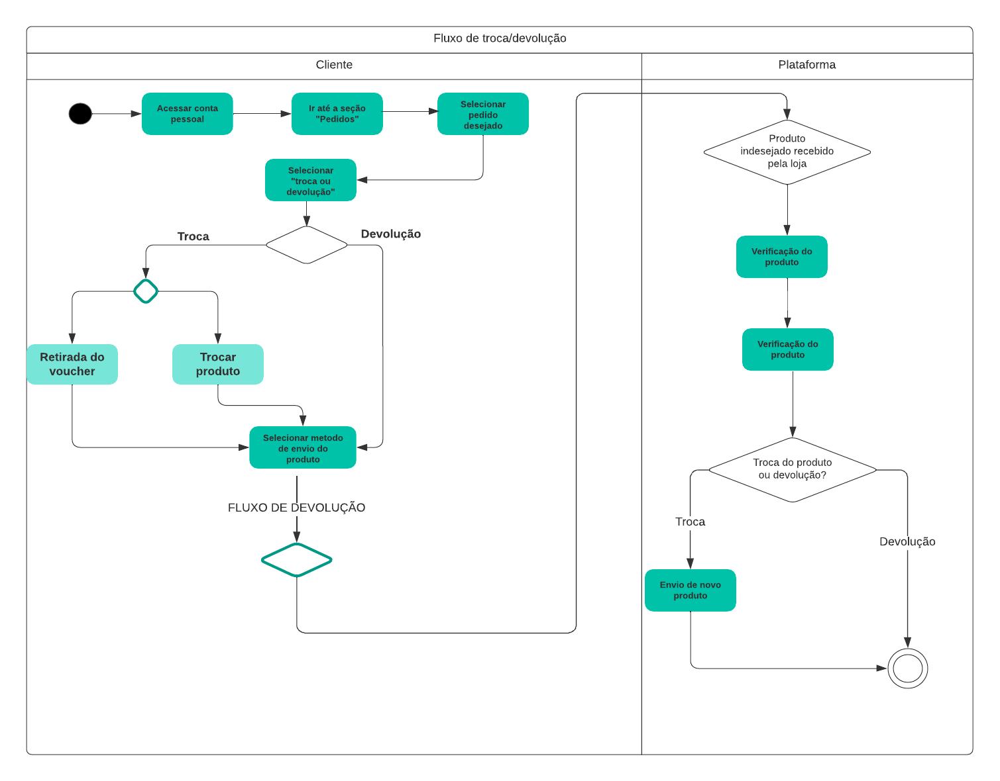
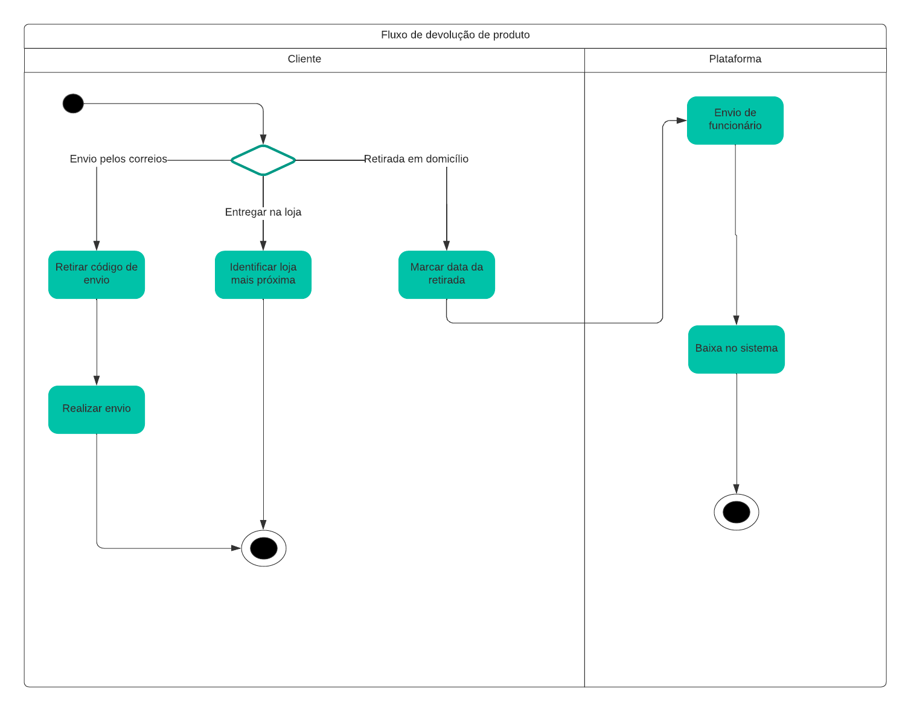

# Diagrama de Atividades

## 1. Definição

O Diagrama de Atividades constitui uma representação visual empregada tanto no UML quanto em outras linguagens de modelagem com o intuito de mapear o fluxo de atividades ou processos em um sistema. Sua aplicação é abrangente, destacando-se na descrição da sequência lógica de um sistema, além de esclarecer as interconexões entre as diversas atividades e tarefas.

Os componentes envolvidos nesse diagrama são:

- **Atividades**: As atividades são as ações ou tarefas que ocorrem no sistema ou processo que está sendo modelado. Elas são representadas por retângulos com rótulos descrevendo a ação.

- **Setas de Controle de Fluxo**: As setas direcionais conectam as atividades e indicam a sequência de execução. Elas mostram a ordem em que as atividades são realizadas e a direção do fluxo.

- **Decisões**: Diamantes são usados para representar decisões ou pontos de decisão no fluxo das atividades. Dependendo das condições, o fluxo pode seguir diferentes caminhos.

- **Forks e Joins**: Símbolos de fork (divisão) e join (união) são usados para representar bifurcações e junções no fluxo de atividades. Eles indicam onde o fluxo é dividido em múltiplos caminhos ou onde vários caminhos convergem em um único ponto.

- **Fluxo de Controle**: O fluxo de controle define a ordem e as condições pelas quais as atividades são executadas. Isso permite representar lógica condicional e loops no processo.

- **Notações Adicionais**: Além dos elementos básicos mencionados, diagramas de atividades podem incluir notações adicionais, como estados, partições (pools), objetos e fluxos de dados, dependendo da complexidade do sistema ou processo sendo modelado.

### 1.1. Simbolos utilizados no Diagrama de Atividades (LucidChart, 2023):

|                                                   Símbolo                                                    | Nome                       | Descrição                                                                   |
| :----------------------------------------------------------------------------------------------------------: | -------------------------- | --------------------------------------------------------------------------- |
|        | Início/ Nódulo Inicial     | Representa ponto de partida ou estado inicial de uma atividade ou ação;     |
|     | Atividade / Estado de Ação | Representa as atividades do processo                                        |
|  | Fluxo de controle / Borda  | Representa o fluxo de controle de uma ação/estado para outra                |
|          | Atividade final Node       | Representa o fim de um fluxo de controle                                    |
|          | Fluxo final Nó             | Representa o fim de todas as tividades                                      |
|             | Nó de Decisão              | Representa um ponto de ramificação condifiocnal com múltiplas saídas        |
|           | Garfo                      | Representa um fluxo que pode se ramificar em dois ou mais fluxos paralelos. |

<h6 align = "center">Figura 1: Legenda dos componentes do diagrama</h6>

## 2. Artefato

### 2.1. Versão 1

<h6 align = "center">Figura 2: Diagrama de atividades</h6>

O diagrama estabelece o fluxo que o cliente deve seguir ao realizar um processo de devolução ou troca de um produto. No caso de uma devolução, o cliente tem a opção de enviar o produto diretamente pelo correio, levá-lo a uma loja física ou solicitar que o item seja coletado em sua residência. No fluxo de troca, o cliente pode escolher entre a substituição do produto por outro ou a obtenção de um voucher de reembolso.

### 2.2. Versão 2

Conforme apontado pelo _feedback_ da professora, eram necessários alguns ajustes no diagrama desenvolvido inicialmente. Portanto, seguem abaixo as novas versões do diagrama de atividades, trazendo maior especificidade e detalhes nos fluxos de troca e devolução.

<h6 align = "center">Figura 3: Fluxo de troca/devolução</h6>

<h6 align = "center">Figura 4: Fluxo de envio de produto</h6>

O diagrama delineia o fluxo de atividades relacionado à troca ou devolução de um produto específico. No cenário de troca, o cliente tem a opção de substituir o item por outro produto (seja o mesmo ou similar) ou optar por receber um voucher para futuras compras. Tanto para o processo de devolução quanto para o de troca, o cliente é solicitado a escolher a modalidade de envio do produto indesejado. As alternativas incluem retirada em domicílio, entrega na loja mais próxima ou envio pelos correios. Essas escolhas oferecem flexibilidade ao cliente no processo de gestão de trocas e devoluções.

## Referências

> LUCIDCHART. O que é UML? Disponível em: https://www.lucidchart.com/pages/pt/o-que-e-uml. Acesso em: 28 set. 2023.

> Milene Serrano - Arquitetura e Desenho de software: Desenho de Software (Modelagem).

## Versionamento

| Versão | Alteração            | Responsável    | Revisor | Data de realização | Data de revisão |
| ------ | -------------------- | -------------- | ------- | ------------------ | --------------- |
| 1.0    | Criação do documento | Carlos Eduardo | Matheus Costa  | 28/09     | 09/10           |
|2.0     | Recriação do diagrama| Carlos Eduardo, Bruno Seiji, Matheus Costa | - | 28/11 | - |
