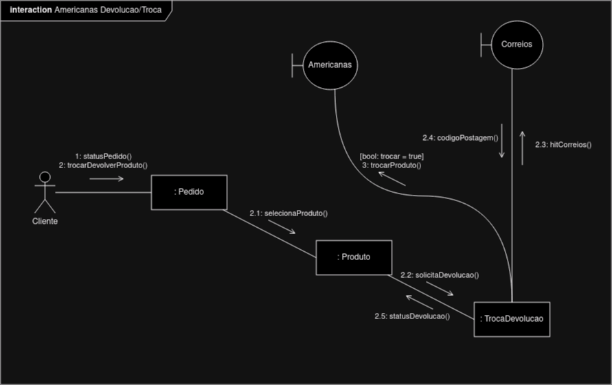
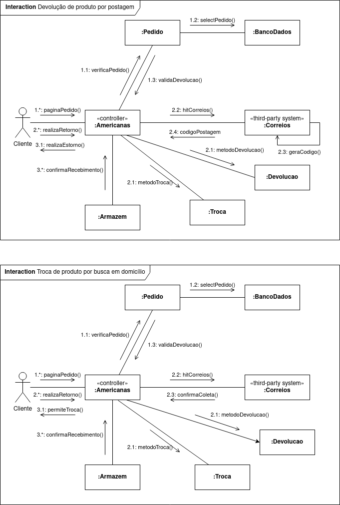

# Diagrama de Comunicação

## 1. Definição

O Diagrama de Comunicação tem como objetivo destacar os relacionamentos estruturais existentes entre as instâncias da interação, juntamente com as mensagens e respostas que podem ser passadas. Faz parte dos Diagramas de Interações e se assemelha fortemente ao Diagrama de Sequências, porém, com ênfase menor na hora e ordem dos eventos e maior nas mensagens trocadas entre objetos.

**Os componentes envolvidos nesse diagrama são:**

- **Objetos ou Lifelines**: Lifelines representam cada objeto que fará parte da interação a ser representada, como exemplo, no diagrama, há os objetos Cliente e TrocaDevolucao;

- **Vínculos**: Vínculos são os caminhos de mensagem entre cada objeto ou função. Os vínculos são usados para identificar os objetos que podem transmitir mensagens na interação;

- **Mensagens**: Uma mensagem é um elemento do UML que define uma comunicação entre instâncias em uma interação, transportando informações entre uma Lifeline e outra.

### 1.1. Artefato

<h6 align = "center">Figura 1: Diagrama de componentes</h6>

O diagrama representa o fluxo de interações entre os objetos do sistema e suas mensagens, que ocorrem quando o usuário busca realizar o processo de devolução ou troca de um produto. Vale destacar a mensagem trocarProduto(), pois ela é condicional e pode ou não ser acessada, a depender da escolha do Cliente.

### 1.2. Artefatos Entrega Final

<h6 align= "center">Figura3: Diagrama de Comunicação atualizado - Fluxos de devolução de produto por postagem & troca de produto por busca em domicílio</h6>

## Referências

> UML Communication Diagrams Overview. Disponível em: https://www.uml-diagrams.org/communication-diagrams.html. Acesso em: 05 out. 2023.

> Communication Diagram Tutorial. Disponível em: https://www.lucidchart.com/pages/uml-communication-diagram. Acesso em: 08 out. 2023.

> Communication Diagrams. Disponível em: https://www.ibm.com/docs/en/rsm/7.5.0?topic=uml-communication-diagrams. Acesso em: 08 out. 2023.

> BOOCH, G. UML: Guia do Usuário. Segunda Edição.

## Versionamento

| Versão | Alteração            | Responsável    | Revisor | Data de realização | Data de revisão |
| ------ | -------------------- | -------------- | ------- | ------------------ | --------------- |
| 1.0    | Criação do documento | Matheus Raphael |   Matheus Costa      | 08/10/2023 |   09/10     |
| 2.0 | Atualização do documento | Matheus Raphael | | 30/11/2023 | 01/12/2023 |
