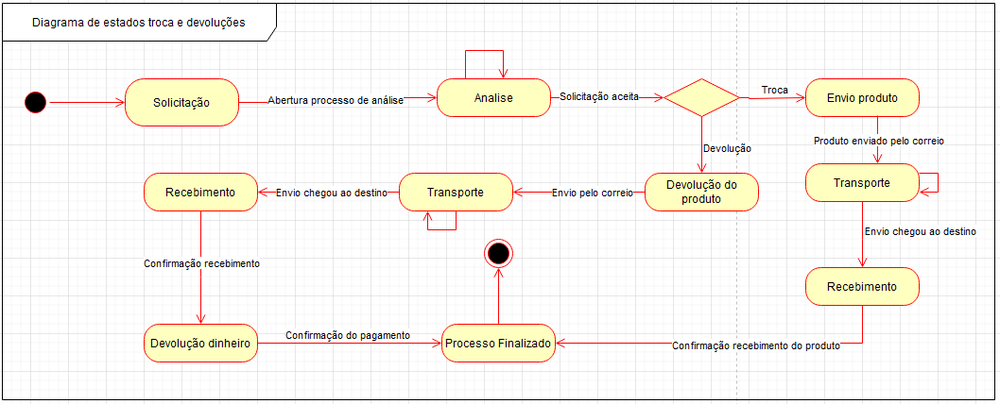

# Diagrama de estados

## 1. Definição

O diagrama de estados é um diagrama dinâmico, que descreve o comportamento de um sistema por meio de estados finitos de transição, um objeto muda de estado quando ocorre algum evento interno ou externo ao sistema. Os diagramas de estados também podem ser utilizados para descrever os protocolos de uso de uma determinada parte do sistema.

## 1.2. Artefato

No diagrama acima, é apresentado os estados que o sistema passa durante as situações de troca ou devolução de produtos.

## 2. Referências

- State Machine Diagrams. Disponível em: https://www.uml-diagrams.org/state-machine-diagrams.html

## Versionamento

| Versão |     Alteração     |  Responsável  | Revisor | Data de realização | Data de revisão 
| :----: | :---------------: | :-----------: | :-----: | :---: | :----:
|  1.0   | Criação documento e diagrama | Bruno Kishibe | Matheus Costa | 08/10 | 08/10