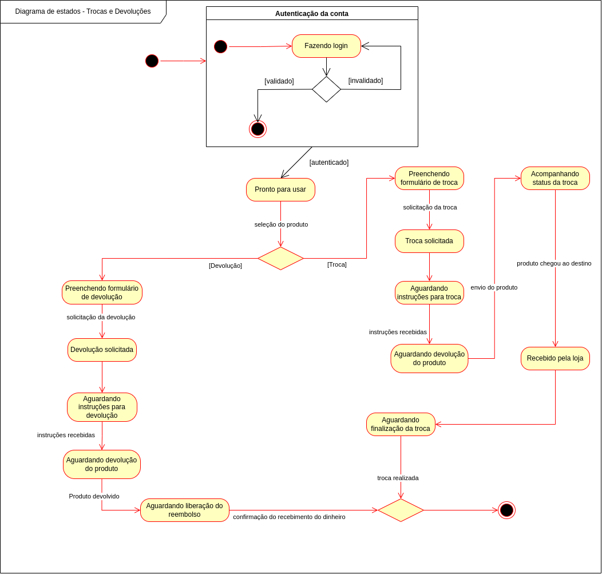

# Diagrama de estados

## 1. Definição

O diagrama de estados é um diagrama dinâmico, que descreve o comportamento de um sistema por meio de estados finitos de transição.
Um objeto muda de estado quando ocorre algum evento interno ou externo ao sistema. Os diagramas de estados também podem ser utilizados para descrever os protocolos de uso de uma determinada parte do sistema.

### Simbolos e componentes utilizados no Diagrama de Atividades (draw.io)

|                                                   Símbolo                                                    | Nome                       | Descrição                                                                   |
| :----------------------------------------------------------------------------------------------------------: | -------------------------- | --------------------------------------------------------------------------- |
|        | Estado Inicial     | Marca o ponto de entrada da utilização do objeto. Normalmente pode ser sua instanciação ou a reinicialização do mesmo para um estado estável inicial.  |   
|        | Estado Final     | Marca o ponto de saída da utilização do objeto. Normalmente pode ser sua destruição (liberação de memória), ou simplesmente o ato de deixar de utilizar o objeto.  |  
|        | Estado atual   | Representa um dos possíveis estados em que o objeto pode se encontrar em cada dado momento. Um estado de um objeto é definido como sendo a identificação de todos os atributos que o compõem;  |  
|        | Condição/decisão   | Elemento que representa uma decisão a ser tomada, e é caracterizado por uma entrada que produz duas ou mais saídas, a depender da condição verificada. |  

## 2. Artefatos
### 2.1. Diagrama de estados v.1

<h6 align = "center">Figura 1: Diagrama de Estados</h6>

No diagrama acima, são apresentados os estados que o sistema passa durante as situações de troca ou devolução de produtos.

### 2.2. Diagrama de estados v.2

<h6 align = "center">Figura 2: Diagrama de Estados - segunda versão</h6>

Com foco na entrega final, e mediante observações feitas pela professora quanto à entrega realizada, a equipe discutiu acerca do diagrama apresentado e propôs uma nova visão quanto à compreensão do fluxo de trocas e devoluções.

Com isso, foi gerada uma nova versão do diagrama pelo integrante Matheus Costa, buscando atender às observações apresentadas pela professora, além de trazer mais detalhes do fluxo e maior conformidade com um Diagrama de Estados de fato.

## Referências

> State Machine Diagrams. Disponível em: https://www.uml-diagrams.org/state-machine-diagrams.html. Acesso em: 08 out. 2023.

> UML Diagrama de Atividades. Disponível em: http://www.theclub.com.br/restrito/revistas/201310/umld1310.aspx. Acesso em: 29 nov. 2023.

## Versionamento

| Versão |     Alteração     |  Responsável  | Revisor | Data de realização | Data de revisão 
| :----: | :---------------: | :-----------: | :-----: | :---: | :----:
|  1.0   | Criação documento e diagrama | Bruno Kishibe | Matheus Costa | 08/10 | 08/10
|  1.1   | Adição de legendas do diagrama | Bruno Kishibe | Matheus Costa | 28/11 | 29/11
|  2.0   | Revisão geral e adição de novo diagrama | Matheus Costa | - | 29/11 | -