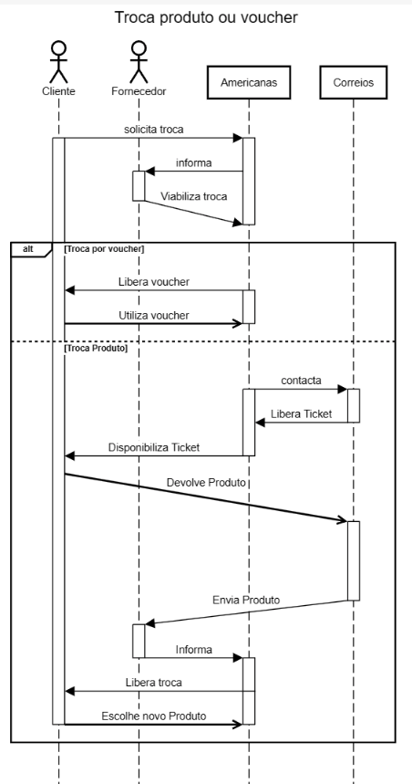
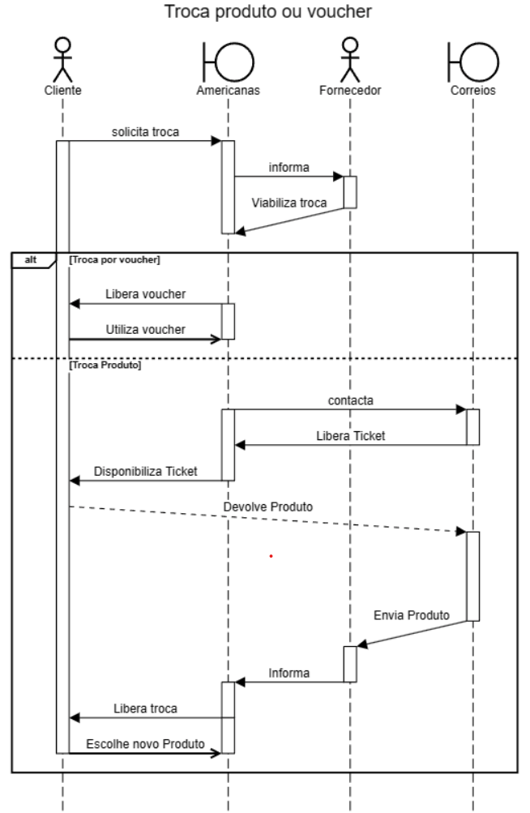

# Diagrama de Atividades

## 1. Definição

Os diagramas de sequência são uma solução popular de modelagem dinâmica em UML porque se concentram especificamente sequencia do projeto, ou nos processos e objetos que funcionam simultaneamente, e nas mensagens trocadas entre eles para executar uma função antes que o ciclo de vida termine.
Os componentes envolvidos nesse diagrama estão a seguir.

### 1.1. Artefatos

O diagrama estabelece o fluxo que o deve ser seguido ao realizar um processo de devolução ou troca de um produto. No caso de uma devolução, o cliente tem a opção de enviar o produto diretamente pelo correio, levá-lo a uma loja física ou solicitar que o item seja coletado em sua residência.

<h6 align = "center">Figura 1: Diagrama de sequência - Devolução de produto</h6>

<h6 align = "center">Figura 2: Diagrama de sequência - Troca de produto</h6>

## Referências

> LUCIDCHART. UML Sequence Diagram Tutorial Disponível em: [https://www.lucidchart.com/pages/pt/o-que-e-uml](https://www.lucidchart.com/pages/uml-sequence-diagram). Acesso em: 02/10/2023.

## Versionamento

| Versão | Alteração            | Responsável    | Revisor | Data de realização | Data de revisão |
| ------ | -------------------- | -------------- | ------- | ------------------ | --------------- |
| 1.0    | Criação do documento | Guilherme Lima |  Matheus Costa  | 05/10      |   09/10      |
