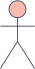
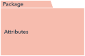
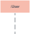
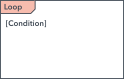
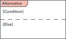
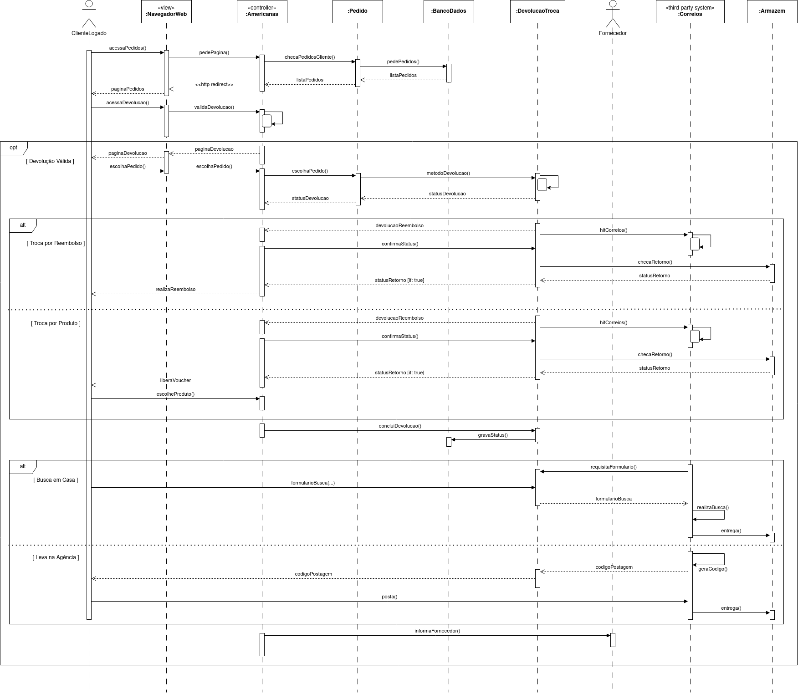

# Diagrama de Sequência

## 1. Definição

Os diagramas de sequência são uma solução popular de modelagem dinâmica em UML porque se concentram especificamente sequencia do projeto, ou nos processos e objetos que funcionam simultaneamente, e nas mensagens trocadas entre eles para executar uma função antes que o ciclo de vida termine.
Os componentes envolvidos nesse diagrama estão a seguir.

### Simbolos e componentes utilizados no Diagrama de Estados

|                                                   Símbolo                                                    | Nome                       | Descrição                                                                   |
| :----------------------------------------------------------------------------------------------------------: | -------------------------- | --------------------------------------------------------------------------- |
|        | Objeto     | Representa uma classe ou objetos em UML. O símbolo do objeto demonstra como um objeto se comportará no contexto do sistema. Atributos de classe não devem ser listados nesta forma.  |   
|        | Caixa de ativação   | Representa o tempo necessário para que um objeto conclua uma tarefa. |  
|        | Ator   | Mostra as entidades que interagem com, ou são externas ao sistema.  |  
|        | Pacote   | contem elementos interativos do diagrama. Também conhecido como quadro. | 
|        | Linhade vida   | Esta linha vertical tracejada mostra os eventos sequenciais que ocorrem a um objeto durante o processo no gráfico. | 
|        | Opção em loop   | Usado para modelar cenários “se/então”, ou seja, uma circunstância que ocorrerá apenas sob determinadas condições. |  
|        | Símbolo alternativo  | Simboliza uma escolha (geralmente mutuamente exclusiva) entre duas ou mais sequências de mensagens.  |  

### 1.1. Artefatos

O diagrama estabelece o fluxo que o deve ser seguido ao realizar um processo de devolução ou troca de um produto. No caso de uma devolução, o cliente tem a opção de enviar o produto diretamente pelo correio, levá-lo a uma loja física ou solicitar que o item seja coletado em sua residência.

<h6 align = "center">Figura 1: Diagrama de sequência - Devolução de produto</h6>

<h6 align = "center">Figura 2: Diagrama de sequência - Troca de produto</h6>

### 1.2. Motivos Atualização
Nesta versão, foi alterada a americanas para controller e correios para third party de acordo com o conversado em aula, bem como atualizado o navegador web como view, adionadas as classes pedidos, banco de dados, devolução troca e armazém.  

### 1.3. Artefatos Entrega Final

<h6 align= "center">Figura3: Diagrama de sequência atualizado - Todos os Fluxos</h6>

## Referências

> LUCIDCHART. UML Sequence Diagram Tutorial Disponível em: [https://www.lucidchart.com/pages/pt/o-que-e-uml](https://www.lucidchart.com/pages/uml-sequence-diagram). Acesso em: 02 out. 2023.

## Versionamento

| Versão | Alteração            | Responsável    | Revisor | Data de realização | Data de revisão |
| ------ | -------------------- | -------------- | ------- | ------------------ | --------------- |
| 1.0    | Criação do documento | Guilherme Lima |  Matheus Costa  | 05/10      |   09/10      |
| 2.0    | Criação do documento | Matheus Oliveira |  Guilherme Lima  | 30/11      |   01/12      |
