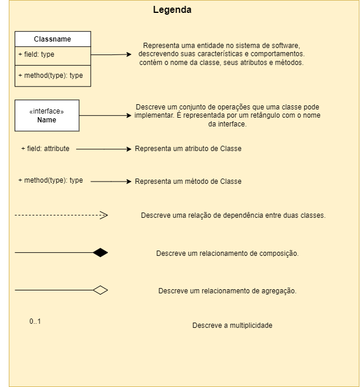
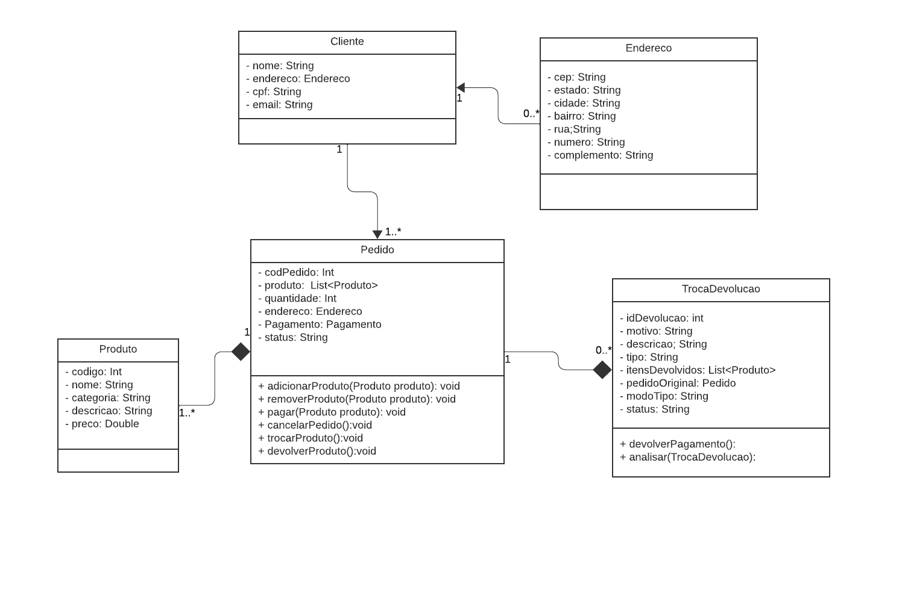
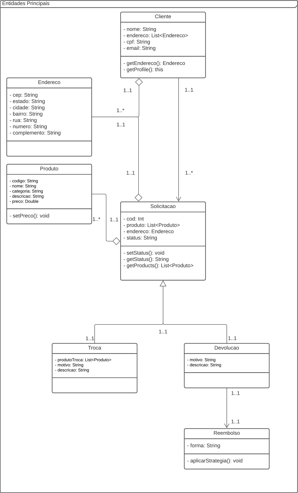
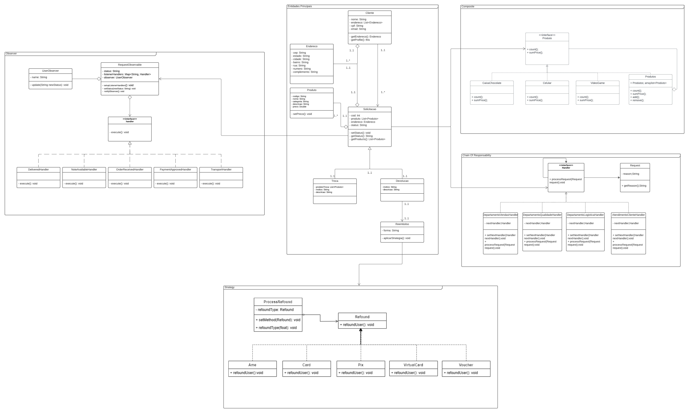

# Diagrama de Classes

## 1. Introdução

UML é a sigla para "Unified Modeling Language" ou "Linguagem de Modelagem Unificada". Trata-se de uma linguagem de modelagem visual que permite representar e comunicar a estrutura, o comportamento e a interação de sistemas complexos de software. Ela foi criada por algumas empresas de software na década de 1990, liderado por Grady Booch, James Rumbaugh e Ivar Jacobson, e é amplamente utilizada em todo o mundo para o desenvolvimento de software.

Diversos diagramas são feitos utilizando a notação UML, e um deles é o Diagrama de Classes, que é um dos principais artefatos utilizados na modelagem de sistemas com paradigma da orientação objetos, portanto uma boa escolha para o desenvolvimento da diciplina de arquitetura de software.

### 1.1. O que é o Diagrama de Classes?

O Diagrama de Classes é uma representação visual das classes, interfaces, atributos e métodos que compõem um sistema de software. Ele descreve a estrutura do sistema, bem como as relações entre seus elementos, sendo assim uma ferramenta para a comunicação e a documentação do design de software, além de servir de base para código do sistema.

## 2. Objetivos

&emsp;&emsp; Segundo [1], através do diagrama de classes, é possível identificar as classes que compõem um sistema, seus atributos e métodos, bem como as relações entre elas. Isso ajuda a garantir que as classes sejam definidas de maneira clara e consistente, com suas funções e responsabilidades bem definidas.

&emsp;&emsp; Além disso, o diagrama de classes pode ajudar a identificar problemas de design, como classes que têm muitas responsabilidades ou dependências desnecessárias. Isso permite que os desenvolvedores identifiquem áreas problemáticas do sistema e trabalhem para corrigir esses problemas antes que eles se tornem mais difíceis e caros de resolver.

&emsp;&emsp; O diagrama de classes também pode ser usado para documentar um sistema existente, ajudando a fornecer uma visão geral do sistema e ajudando a facilitar a manutenção e o desenvolvimento futuro. Isso é especialmente útil em sistemas complexos, onde a documentação é fundamental para garantir que o sistema possa ser mantido e expandido com segurança e eficiência.

## 3. Participantes

Nas reuniões para desenvolvimento do artefato, num primeiro momento foi realizado pelo aluno Alex Gabriel, porém, com o feedback da professora e as melhorias propostas para a última entrega, os ajustes foram feitos pelos alunos Carlos Rafael e Gabriel Ribeiro.

Ambas versões do diagrama poderão ser vistas logo a seguir.

## 4. Metodologia

No processo de criação do nosso diagrama de classes, iniciamos identificando as classes potenciais envolvidas no fluxo de troca e devolução. A seguir, utilizamos a ferramenta Lucidchart para desenhar essas classes, especificando seus atributos e estabelecendo os relacionamentos entre elas. 

### 4.1. Legenda
Por padrão utilizamos alguns dos seguintes elementos em nosso diagrama:

<h6 align = "center">Figura 1: Legenda</h6>

## 5. Diagramas
### 5.1. Versão 1

<h6 align = "center">Figura 2: Diagrama de classes - versão Alex Gabriel</h6>

### 5.2. Versão 2

<h6 align = "center">Figura 3: Diagrama de classes - versão Carlos Rafael</h6>

### 5.3. Versão 3

<h6 align = "center">Figura 4: Diagrama de classes - versão final</h6>

## Referências

> LUCIDCHART. **O que é um diagrama de classe UML?**. Disponível em: https://www.lucidchart.com/pages/pt/o-que-e-diagrama-de-classe-uml **Acesso em:** 04 out. 2023.

> **UML Class Diagrams Reference**. Disponível em: https://www.uml-diagrams.org/class-reference.html. Acesso em: 30 nov. 2023

> [1] **The UML 2 class diagram**. Disponível em: https://developer.ibm.com/articles/the-class-diagram/. Acesso em: 30 nov. 2023

## Versionamento

| Versão |               Alteração               |  Responsável  |    Revisor    | Data de realização | Data de revisão |
| :----: | :-----------------------------------: | :-----------: | :-----------: | :----------------: | :-------------: |
|  1.0   |         criação do documento          | Alex Gabriel  | Bruno Kishibe |     04/10/2023     |   09/10/2023    |
|  2.0   | criação da segunda versão do diagrama e melhorias no documento | Carlos Rafael e Gabriel Ribeiro |  Matheus Costa  |     30/11/2023     |   01/12/2023     |
