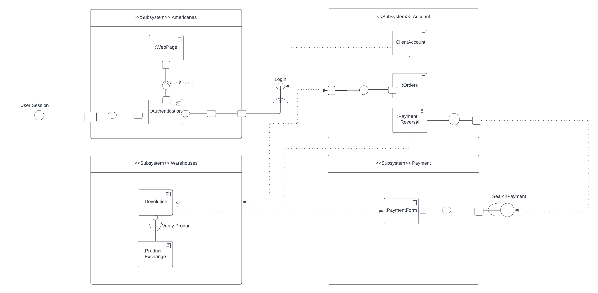

# Diagrama de Componentes

## 1. Introdução
Os diagramas de componentes tem como objetivo mostrar a estrutura do sistema de software, que descreve os componentes do software, suas interfaces e suas dependências. É possível utilizar diagramas de componentes para modelar sistemas de software em um alto nível ou para mostrar componentes em um nível de pacote mais baixo.

### Simbolos e componentes utilizados no Diagrama de Estados

|                                                   Símbolo                                                    | Nome                       | Descrição                                                                   |
| :----------------------------------------------------------------------------------------------------------: | -------------------------- | --------------------------------------------------------------------------- |
|        | Componente     | Marca o ponto de entrada da utilização do objeto. Normalmente pode ser sua instanciação ou a reinicialização do mesmo para um estado estável inicial.  |   
|        | Nó   | Representa objetos de hardware ou software, que estão em um nível superior ao dos componentes  |  
|        | Porta   | Especifica um ponto de interação separado entre o componente e o ambiente. As portas são simbolizadas por um pequeno quadrado.  |  
|        | Dependência   | Mostra que uma parte do  sistema depende de outra. Dependências são representadas por linhas tracejadas que conectam um componente (ou elemento) a outro |  

## 3. Artefato anterior
Após feedback da professora, foi gerado uma nova versão do diagrama, porém foi encontrado um impedimento devido a limitação da ferramenta Lucid Chart para criação do diagrama. Fica o adendo para a falta de algumas portas e interfaces no diagrama.

## 2. Artefato Atualizado

<h6 align = "center">Figura 1: Diagrama de Componentes Gabriel de Souza e Guilherme Lima</h6>

<h6 align = "center">Figura 2: Nova versão Diagrama de Componentes</h6>

## Referências

> LUCIDCHART. **O que é um diagrama de componentes UML?**. Disponível em: <a href="https://www.lucidchart.com/pages/pt/diagrama-de-componentes-uml" target="__blank">https://www.lucidchart.com/pages/pt/diagrama-de-componentes-uml</a>. **Acesso em:** 04 out. 2023.

## Versionamento

| Versão | Alteração |  Responsável  | Revisor | Data de realização | Data de revisão |
| :------: | :---: | :-----: | :----: | :----: | :-----: |
| 1.0    | criação do diagrama de componentes| Gabriel de Souza | Matheus Costa | 04/10/2023| 09/10/2023 |
| 2.0    | correções e novo diagrama de componentes| Gabriel de Souza | Matheus Costa | 09/10/2023| 09/10/2023 |

