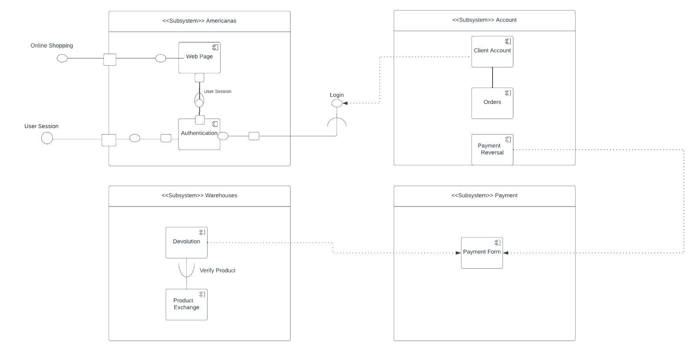

# Diagrama de Componentes

## 1. Introdução
Os diagramas de componentes tem como objetivo mostrar a estrutura do sistema de software, que descreve os componentes do software, suas interfaces e suas dependências. É possível utilizar diagramas de componentes para modelar sistemas de software em um alto nível ou para mostrar componentes em um nível de pacote mais baixo.

## 2. Artefato

<h6 align = "center">Figura 1: Diagrama de Componentes Gabriel de Souza</h6>

## Referências

> LUCIDCHART. **O que é um diagrama de componentes UML?**. Disponível em: <a href="https://www.lucidchart.com/pages/pt/diagrama-de-componentes-uml" target="__blank">https://www.lucidchart.com/pages/pt/diagrama-de-componentes-uml</a> **Acesso em:** 04 out. 2023.

## Versionamento

| Versão | Alteração |  Responsável  | Revisor | Data de realização | Data de revisão |
| :------: | :---: | :-----: | :----: | :----: | :-----: |
| 1.0    | criação do diagrama de componentes| Gabriel de Souza | Matheus Costa | 04/10/2023| 09/10/2023 |

