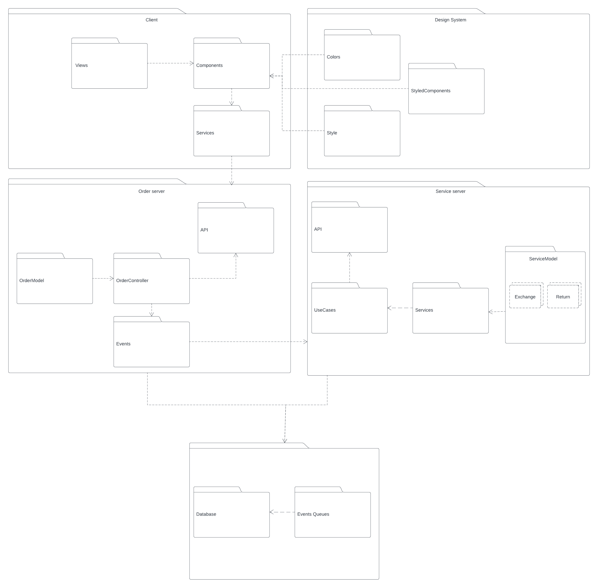
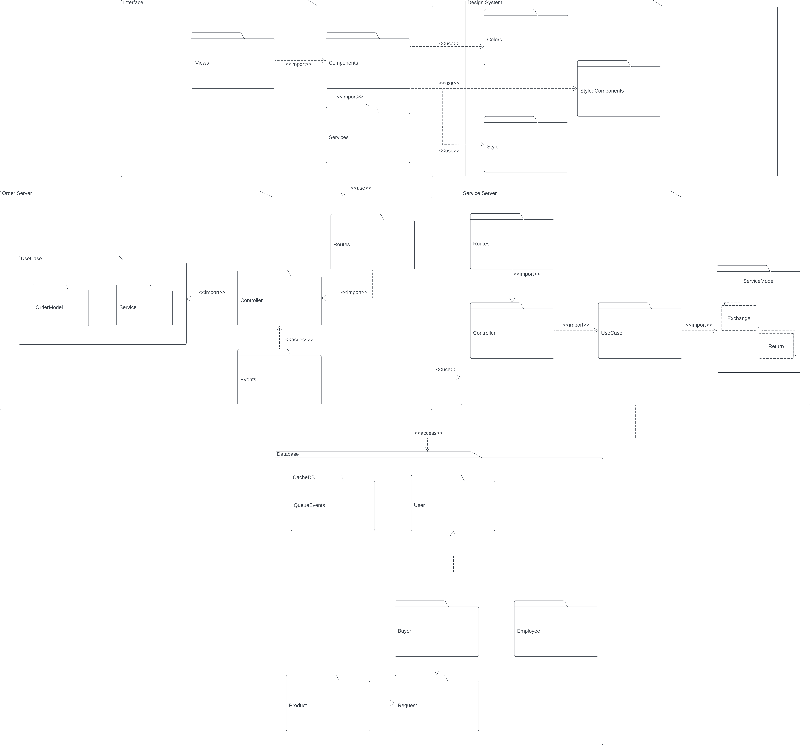

# Diagrama de Pacotes

## 1. Definição

São diagramas estruturais representados por pacotes compostos de classes, diagramas ou até mesmo outros pacotes, com o objetivo de organizar visualmente uma arquitetura e subdivisões da mesma. Onde os pacotes ilustram um sistema, biblioteca, uma etapa do desenvolvimento, dependendo do contexto.

### 1.1. Artefato

<h6 align = "center">Figura 1: Diagrama de pacotes</h6>

O artefato apresentado oferece uma perspectiva macro dos pacotes, os quais representam partes do sistema. A maneira como esses pacotes se relacionam lembram a ideia de componentes e funcionalidades reutilizáveis.

### 1.2. Diagrama de pacotes - segunda versão

Após considerações feitas pela professora, foi gerado um novo diagrama.

<h6 align = "center">Figura 2: Diagrama de pacotes - Versão 2</h6>

### 1.3. Diagrama de pacotes - terceira versão

<h6 align = "center">Figura 3: Diagrama de pacotes - Versão 3</h6>

### 2. Macro Pacotes

- **Interface:** Esse pacote ilustra camadas da interface de forma relacional, dividida em 3 principais

  - Views: Camada responsável por organizar as páginas da interface.
  - Components: Camada responsável por organizar os componentes que compoẽ as páginas e/ou outros componentes
  - Services: Camada que atua como proxy de comunicação client/server

- **Design System:** Esse pacote ilustra camadas de design padronizados, é dividida em 3 principais

  - Style: Camada responsável por configurar estilos comum da interface animações e posicionamento de componentes
  - StyledComponents: Camada responsável por organizar componentes comuns entre aplicações front-end
  - Colors: Cores padrão das aplicações front-end

- **Order Server:** Esse pacote ilustra regras de negócio relacionadas a solicitação de troca ou devolução.

  - UseCases: Camada responsável por mapear casos de usos, tornando-se conhecido para os controladores
  - Controllers: Camada responsável por orquestrar os casos de uso
  - Routes: Camada responsável pelo roteamento das api's
  - Events: Camada responsável por eventos decorrentes de mudanças na solicitação

- **Service Server:** Esse pacote ilustra regras de negócio relacionadas a atividades de eventos e filas de pagamento

  - ServiceModel: Modelo de serviço
  - UseCase: Camada responsável por mapear casos de usos, tornando-se conhecido para os controladores
  - Controller: Camada responsável por orquestrar os casos de uso
  - Routes: Camada responsável pelo roteamento das api's

## Referências

> LUCIDCHART. Tudo sobre diagramas de pacotes UML Disponível em: https://www.lucidchart.com/pages/pt/diagrama-de-pacotes-uml. Acesso em: 02 out. 2023.

> Diagrama de Pacotes: Definição, Componentes e Exemplos Disponível em: https://gitmind.com/pt/diagrama-de-pacotes.html. Acesso em: 09 out. 2023.

## Versionamento

| Versão | Alteração                          | Responsável   | Revisor         | Data de realização | Data de revisão |
| ------ | ---------------------------------- | ------------- | --------------- | ------------------ | --------------- |
| 1.0    | Criação do documento               | Carlos Rafael | Matheus Raphael | 07/10              | 08/10           |
| 2.0    | Adição de novo diagrama - versão 2 | Carlos Rafael | Matheus Costa   | 09/10              | 09/10           |
| 3.0    | Adição de novo diagrama - versão 3 | Carlos Rafael | -               | 30/11              | -               |
