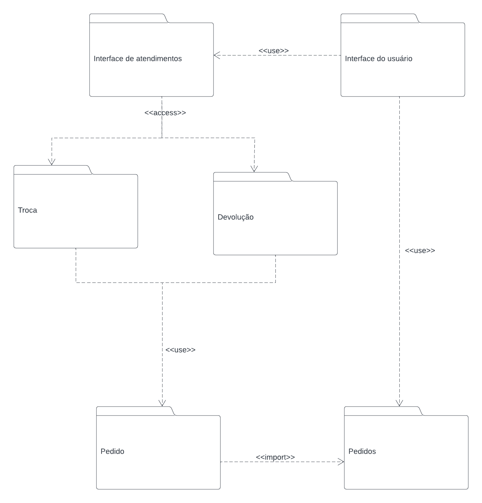

# Diagrama de Pacotes

## 1. Definição

São diagramas estruturais representados por pacotes compostos de classes, diagramas ou até mesmo outros pacotes, com o objetivo de organizar visualmente uma arquitetura e subdivisões da mesma. Onde os pacotes ilustram um sistema, biblioteca, uma etapa do desenvolvimento, dependendo do contexto.

### 1.1. Artefato

O artefato apresentado oferece uma perspectiva macro dos pacotes, os quais representam partes do sistema. A maneira como esses pacotes se relacionam lembram a ideia de componentes e funcionalidades reutilizáveis.

## Referências

> LUCIDCHART. Tudo sobre diagramas de pacotes UML Disponível em: https://www.lucidchart.com/pages/pt/diagrama-de-pacotes-uml. Acesso em: 02 out. 2023.

## Versionamento

| Versão | Alteração            | Responsável    | Revisor | Data de realização | Data de revisão |
| ------ | -------------------- | -------------- | ------- | ------------------ | --------------- |
| 1.0    | Criação do documento | Carlos Rafael| Matheus Raphael | 07/10              | 08/10 |
