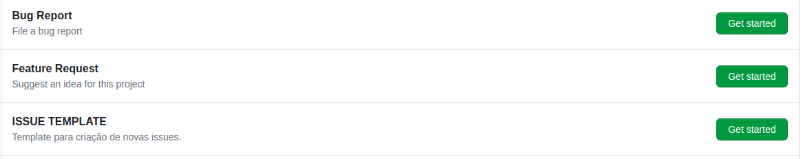
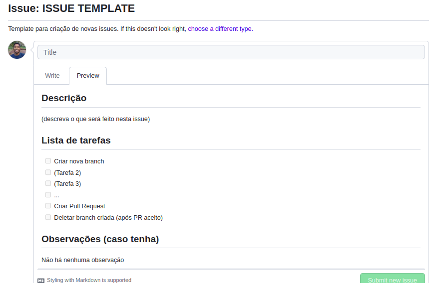
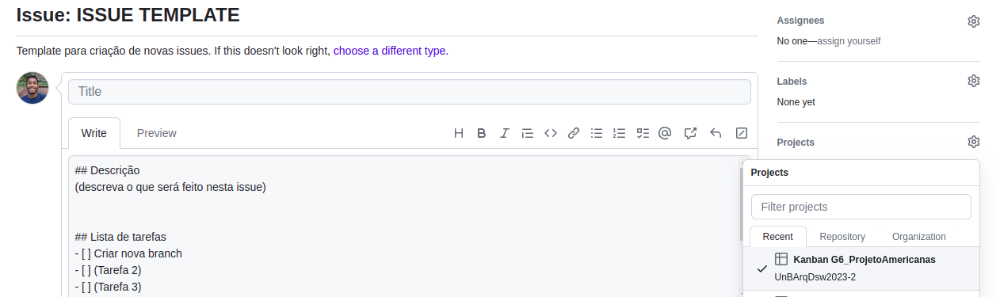

# Política de issues

## 1. Introdução

Este documento contém informações referentes à política de issues adotada pela equipe.

## 2. Metodologia

Em conformidade com as metodologias escolhidas pela equipe, tem-se o uso do Kanban.

Um dos focos do Kanban é tornar o trabalho visível, portanto, é comumente utilizado o quadro Kanban, no qual são adicionados _cards_, que representam as tarefas, em diferentes colunas o quadro, indicando o fluxo de trabalho.

Diante disto, buscando aprimorar essa visualização e a integração das atividades da equipe com a aplicação do Kanban, foi gerada uma política de issues.

## 3. Definições da equipe

Um template de issues foi criado, buscando padronizar a estrutura das tarefas a serem realizadas ao longo da disciplina.

Assim, o fluxo de criação de uma nova issue e criação de um novo _card_ no Kanban da equipe, ocorre da seguinte maneira:

1°: No repositório, acessar a aba de "Issues" e clicar em criar uma nova issue

2°: Selecionar o template "ISSUE TEMPLATE", que foi gerado pela equipe, conforme a seguinte figura

<h6 align = "center">Figura 1: escolha do template</h6>

3°: Preencher o template de acordo com a atividade a ser feita, conforme o template

<h6 align = "center">Figura 2: visualização do template</h6>

4°: Antes de criar a issue, adicioná-la ao Kanban da equipe, para ser gerado um _card_

<h6 align = "center">Figura 3: adicionando issue ao Kanban</h6>

5°: Finalizar a criação da issue

6°: Por fim, iniciar a atividade e ir atualizando tanto as tarefas da issue quanto o status da atividade no Kanban, conforme o desenvolvimento.

## Referências

> **Método Kanban**: Guia detalhado e 5 modelos prontos para usar. Blog Trello. Disponível em: <a href="https://blog.trello.com/br/metodo-kanban" target="__blank">https://blog.trello.com/br/metodo-kanban</a>. **Acesso em:** 27 set. 2023.

 

## Versionamento

| Versão | Alteração |  Responsável  | Revisor | Data de realização | Data de revisão |
| :------: | :---: | :-----: | :----: | :----: | :-----: |
| 1.0    | criação do documento | Matheus Costa | a definir | 27/09/2023| a definir |

