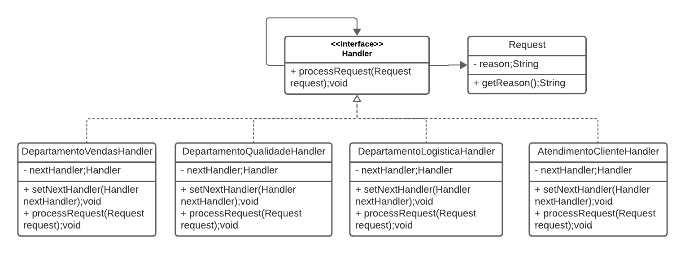

# 3.1 Chain of responsability

## Introdução
De acordo com [1], o Chain of Responsibility é um padrão de projeto comportamental que permite que você passe pedidos por uma corrente de handlers. Ao receber um pedido, cada handler decide se processa o pedido ou o passa adiante para o próximo handler na corrente.

O padrão será aplicado para encaminhar as solicitações de troca ou devolução para o departamento específico, levando em consideração o motivo associado a cada solicitação.

  

<h6 align = "center">Figura 1: Diagrama UML Chain of responsability  Fonte: [1] Refactoring Guru</h6>

## Objetivo

O objetivo principal de usar o padrão Chain of Responsibility é proporcionar uma maneira flexível e desacoplada de lidar com solicitações, permitindo que cada manipulador na cadeia decida se pode processar a solicitação ou a deve passar para o próximo manipulador. Isso promove a flexibilidade, a extensibilidade e a manutenção simplificada do código, facilitando a adição, remoção e modificação de manipuladores sem afetar o restante do sistema. O padrão é particularmente útil em cenários onde diferentes partes do sistema têm responsabilidades específicas e podem tratar diferentes tipos de solicitações.

Em essência, ao aplicar o Chain of Responsibility, estamos melhorando a organização do código, tornando-o mais flexível, fácil de estender, adaptável a mudanças e mais simples de manter, o que contribui para um design mais eficaz e sustentável do sistema.

## Implementação
A implementação do padrão de projeto foi realizada usando a linguagem Java e criando uma abstração de como funcionaria no sistema da Lojas Americanas. 

### Diagrama UML
Modelagem utilizando a ferramenta online [lucidchart](https://www.lucidchart.com/pages/)

<h6 align = "center">Figura 2: Codigo dep. vendas. Fonte: Alex Gabriel</h6>

### Código

A implementação pode ser encontrada na pasta Code/chain-of-responsability do repositório do projeto. 

#### Interface do Handler.

<h6>Figura 3: Codigo Handler. Fonte: Alex Gabriel</h6>

#### Requisição.

<h6>Figura 4: Codigo Requisição. Fonte: Alex Gabriel</h6>

#### Handler concretos.

##### Departamento de vendas.

<h6>Figura 5: Codigo dep. vendas. Fonte: Alex Gabriel</h6>

##### Departamento de qualidade.

<h6>Figura 6: Codigo dep. qualidade. Fonte: Alex Gabriel</h6>

##### Departamento de logística.

<h6>Figura 7: Codigo dep. logistica. Fonte: Alex Gabriel</h6>

##### Departamento de atendimento ao cliente.

<h6>Figura 8: Codigo dep. vendas. Fonte: Alex Gabriel</h6>

## Referências

> [1] Refactoring Guru. **Chain of Responsibility**. Disponível em: https://refactoring.guru/pt-br/design-patterns/chain-of-responsibility **Acesso em:** 29 nov. 2023.

## Versionamento

| Versão | Alteração |  Responsável  | Revisor | Data de realização | Data de revisão |
| :------: | :---: | :-----: | :----: | :----: | :-----: |
| 1.0    | criação do documento, codigo e diagramas | Alex Gabriel | - | 29/11/2023| 30/11/2023 |
