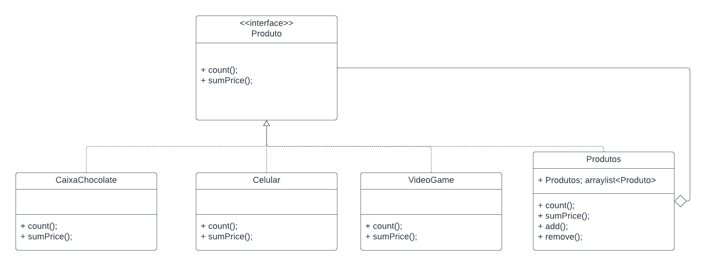
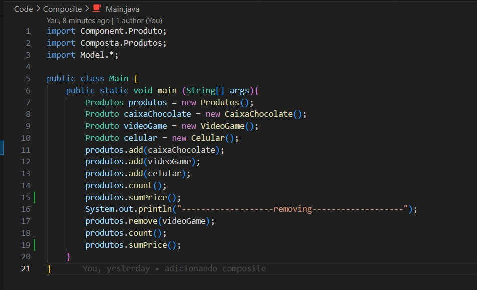

# Composite - GoF Estrutural

## 1. Introdução
De acordo com [1], o Composite é um padrão de projeto estrutural que permite que você componha objetos em estruturas de árvores e então trabalhe com essas estruturas como se elas fossem objetos individuais.

O padrão será aplicado na seleção dos itens que serão escolhidos para entrar no fluxo de devolução/troca.

  

<h6 align = "center">Figura 1: Exemplo de Diagrama UML Composite  Fonte: [1] Refactoring Guru</h6>

## 2. Objetivo

O objetivo principal de usar o padrão Composite é proporcionar uma experiência mais flexível e eficiente para os usuários, permitindo que eles gerenciem suas devoluções de maneira intuitiva, selecionando produtos individualmente ou agrupando-os conforme necessário. Facilitando assim a manutenção do código, tornando-o mais robusto contra mudanças futuras. Se a lógica de troca ou devolução precisar ser expandida para lidar com novos requisitos, o padrão Composite oferece uma base sólida. Este padrão simplifica operações que precisam ser realizadas recursivamente, como calcular o valor total dos produtos a serem trocados ou devolvidos, assim também como a quantidade selecionada dos produtos.

Em essência, ao aplicar o Composite, o resultado será em um sistema mais adaptável às mudanças nos requisitos e às evoluções futuras do catálogo de produtos.

## 3. Problemática e solução
A problemática que possibilitou a aplicação dos padrões de projeto no fluxo de devolução/troca da Americanas foi a funcionalidade de seleção dos produtos, ativada logo após a solicitação da troca ou devolução. 
A partir dessa funcionalidade foi elencada a possibilidade da criação de um padrão Composite, dedvido a diversidade de produtos que podem ser escolhidos e as suas quantidades. Foi discutido e implementado também a possibilidade de algumas funções adicionais serem adicionadas em caso de devolução como calcular o valor dos produtos selecionados que será devolvido.

## 4. Implementação
A implementação do padrão de projeto foi realizada usando a linguagem Java e criando uma abstração de como funcionaria no sistema da Lojas Americanas. 

### 4.1. Diagrama UML
Modelagem utilizando a ferramenta online [Lucidchart](https://www.lucidchart.com/pages/).

<h6 align = "center">Figura 2: Codigo seleção de produtos. Fonte: Gabriel Ribeiro</h6>

### 4.2. Código

A implementação foi feita utilizando a linguagem Java e pode ser encontrada na pasta Code/Composite na base do repositório do projeto.

### 4.3. Interface do Produto

<h6 align = "center">Figura 3: Codigo Interface. Fonte: Gabriel Ribeiro</h6>

### 4.4. Composite

<h6 align = "center">Figura 4: Codigo Composite. Fonte: Gabriel Ribeiro</h6>

### 4.5. Models

<h6 align = "center">Figura 5: Codigo leaf caixa_chocolate. Fonte: Gabriel Ribeiro</h6>

<h6 align = "center">Figura 6: Codigo leaf celular. Fonte: Gabriel Ribeiro</h6>

<h6 align = "center">Figura 7: Codigo leaf video_game. Fonte: Gabriel Ribeiro</h6>

### 4.6. Main

Para fins didáticos, foi gerado também um exemplo para simular o fluxo.

<h6 align = "center">Figura 8: Codigo Main. Fonte: Gabriel Ribeiro</h6>

<h6 align = "center">Figura 9: Codigo Main. Fonte: Gabriel Ribeiro</h6>

## Referências

> [1] Refactoring Guru. **Chain of Responsibility**. Disponível em: https://refactoring.guru/pt-br/design-patterns/chain-of-responsibility **Acesso em:** 29 nov. 2023.

> **Arquitetura e Desenho de Software - Aula GoFs Estruturais**. Material de apoio em slides. Milene Serrano.

## Versionamento

| Versão | Alteração |  Responsável  | Revisor | Data de realização | Data de revisão |
| :------: | :---: | :-----: | :----: | :----: | :-----: |
| 1.0    | criação do documento, codigo e diagramas | Gabriel Ribeiro | Matheus Costa | 29/11/2023| 29/11/2023 |
| 2.0    | aplicando algumas alterações | Gabriel Ribeiro | Matheus Costa | 30/11/2023| 30/11/2023 |