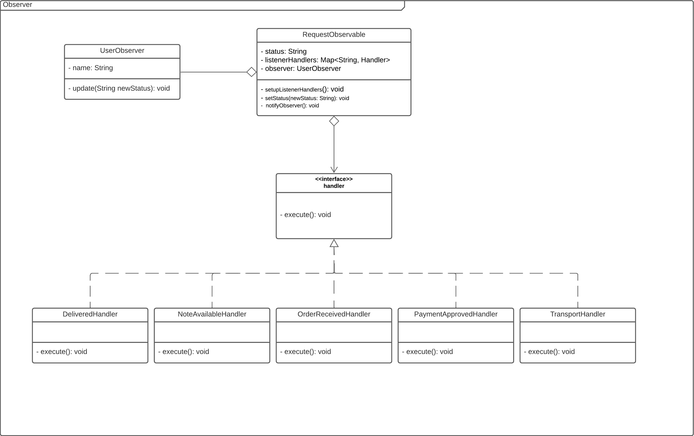

# Observer

## 1. Introdução

O padrão de projeto Observer atua como uma estrutura de notificação que, em resumo, envolve dois papéis principais: o observador e o observado. Nesse contexto, o observador é notificado sempre que ocorre uma alteração no objeto observado. Esse padrão é valioso para estabelecer uma comunicação eficiente entre componentes, permitindo que os observadores respondam dinamicamente a mudanças no estado do observado. Essa abordagem facilita a manutenção, a extensibilidade e a coerência entre os elementos do sistema.

## 2. Objetivo

**Desacoplamento**: Permite interação flexível entre objetos observados e observadores, facilitando a manutenção do código.

**Notificação Automática**: Informa automaticamente objetos interessados sobre mudanças no estado do objeto observado.

**Extensibilidade**: Adiciona novos observadores sem modificar o código do objeto observado, tornando o sistema mais flexível.

**Coerência entre Observadores**: Mantém consistência ao notificar todos os observadores sobre alterações no objeto observado.

**Manutenção Simplicada**: Facilita ajustes em componentes sem afetar diretamente outros, promovendo a evolução do sistema.

## 3. Implementação

A implementação do padrão de projeto foi realizada usando a **linguagem Java** e criando uma abstração de como funcionaria no contexto de status do pedido após devolução ou troca no sistema da **Lojas Americanas**.

### 3.1. Diagrama UML

Modelagem utilizando a ferramenta online [Lucidchart](https://www.lucidchart.com/pages/).

<h6 align = "center">Figura 2: Código status do pedido. Fonte: Carlos Rafael</h6>

### 3.2. Código

O código fonte está disponivel no diretório: [Aqui](../../Code/Observer/Main.java)

#### 3.2.1 Interface do Handler.

<h6 align = "center">Figura 3: Código status do pedido. Fonte: Carlos Rafael</h6>

#### 3.2.2. Listeners Implementados.

<h6 align = "center">Figura 4: Código status do pedido. Fonte: Carlos Rafael</h6>

#### 3.2.3. Observador e Observado.

##### 3.2.3.1. User Observer

<h6 align = "center">Figura 5: Código status do pedido. Fonte: Carlos Rafael</h6>

##### 3.2.3.2. Request Observable

<h6 align = "center">Figura 6: Código status do pedido. Fonte: Carlos Rafael</h6>

## Referências

> Refactoring Guru. **Observer**. Disponível em: https://refactoring.guru/design-patterns/observer **Acesso em:** 30 nov. 2023.

> **Arquitetura e Desenho de Software - Aula GoFs Comportamentais**. Material de apoio em slides. Milene Serrano.

## Versionamento

| Versão |                Alteração                 |  Responsável  | Revisor | Data de realização | Data de revisão |
| :----: | :--------------------------------------: | :-----------: | :-----: | :----------------: | :-------------: |
|  1.0   | criação do documento, codigo e diagramas | Carlos Rafael |    -    |     01/11/2023     |   01/11/2023    |
