# 3.1 Strategy

## Introdução
O strategy sugere que seja pega uma classe que faz algo específico de maneiras diferentes e extrai todos esses algoritimos para classes separadas chamadas estratégias. 
Este padrão de projeto será utilizado para implementar os diferentes tipos de reembolso disponíveis na Americanas.

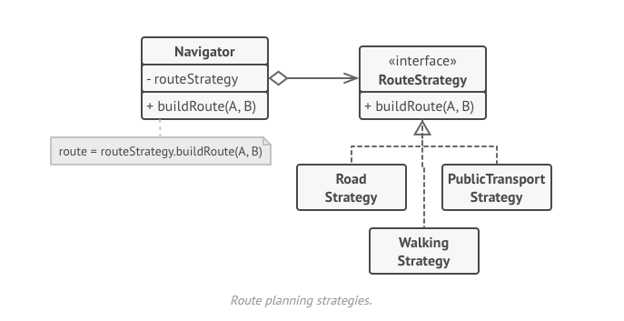  

<h6 align = "center">Figura 1: Diagrama UML Strategy  Fonte: [1] Refactoring Guru</h6>

## Objetivo
O objetivo principal do strategy é permitir a utilização de diferentes variantes de um algorítimo dentro de um objeto, ser capaz de trocar de um algorítimo para outro durante a execução, 
bem como a generalização de classes muito parecida que diferem apenas na forma como elas executam um comportamento expecifico.
Este padrão de projeto também permite o isolamento do código melhorando consequentemente a organização, modularização, compreeção e capacidade de futuras expançoes e alterações caso seja necessário, por exemplo a criação de um novo método de devolução de pagamento.  

## Implementação Reembolso
A implementação do padrão de projeto foi realizada usando a linguagem Java e criando uma abstração de como funcionaria no sistema da Lojas Americanas.

### Diagrama UML
Modelagem utilizando a ferramenta [drawio](https://www.drawio.com)

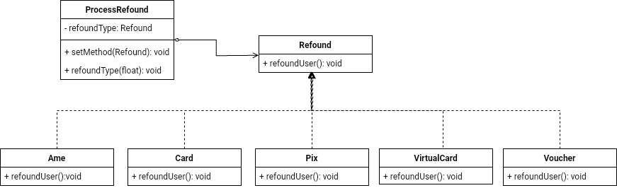
<h6 align = "center">Figura 2: Diagrma UML reembolso Fonte: Guilherme Lima</h6>

### Código

A implementação pode ser encontrada na pasta Code/Strategy do repositório do projeto.

#### Interface reembolso

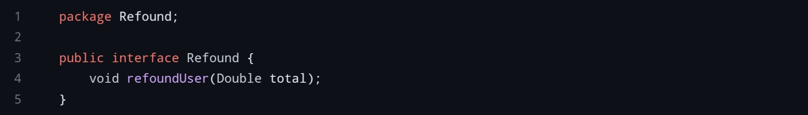
<h6 align = "center">Figura 3: Código Interface Refound Fonte: Guilherme Lima</h6>

#### Strategy Ame

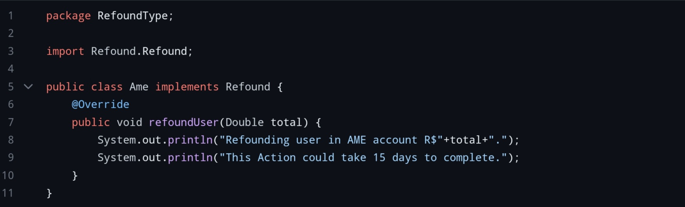
<h6 align = "center">Figura 4: Código Ame Refound Fonte: Guilherme Lima</h6>

#### Strategy Cartão

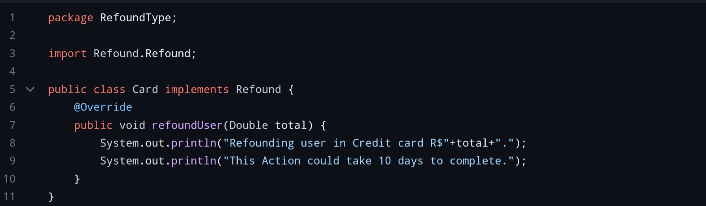
<h6 align = "center">Figura 5: Código cartão Refound Fonte: Guilherme Lima</h6>

#### Strategy Pix

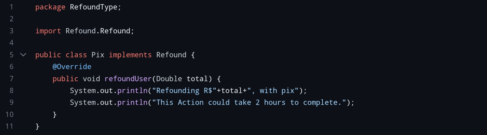
<h6 align = "center">Figura 6: Código PIX Refound Fonte: Guilherme Lima</h6>

#### Strategy Virtual Card

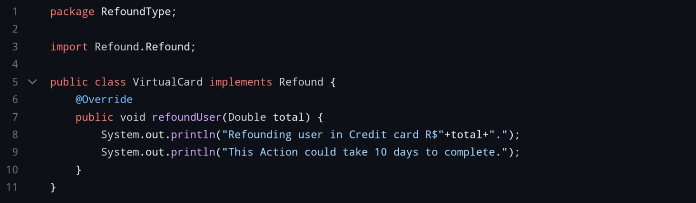
<h6 align = "center">Figura 7: Código VirtualCard Refound Fonte: Guilherme Lima</h6>

#### Process Refound

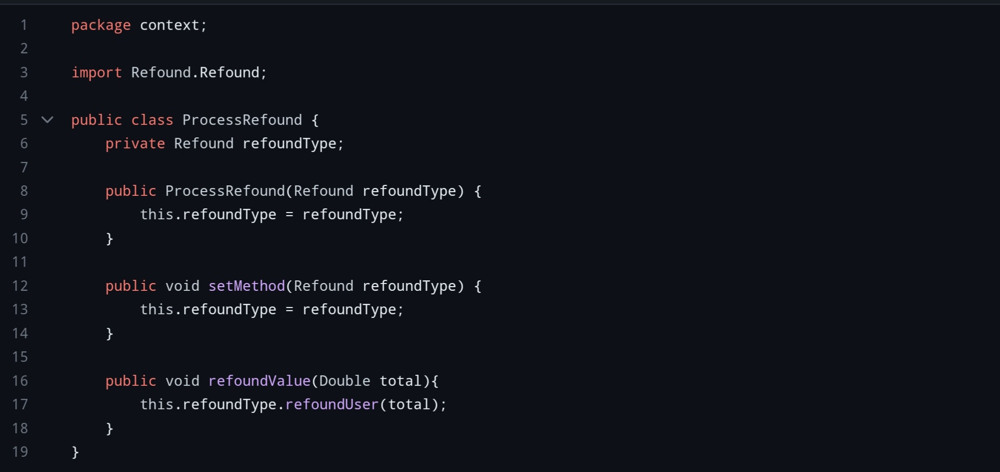
<h6 align = "center">Figura 8: Código Process Refound Fonte: Guilherme Lima</h6>

## Implementação Troca/Devolução

A implementação do padrão de projeto foi realizada usando a linguagem Java e criando uma abstração de como funcionaria no sistema da Lojas Americanas para a troca/devolução de produtos.

### Diagrama UML

Modelagem utilizando a ferramenta [lucidapp](https://lucid.app/)

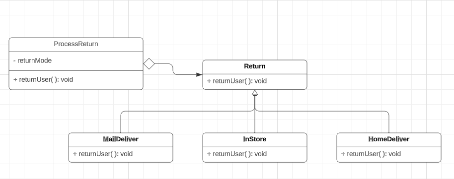
<h6 align = "center">Figura 9: Diagrama UML troca/devolução Fonte: Bruno Seiji</h6>

### Código

#### Interface troca/devolução

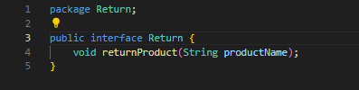
<h6 align = "center">Figura 10: Código Interface troca/devolução Fonte: Bruno Seiji</h6>

#### Strategy HomeDeliver

<h6 align = "center">Figura 11: Código Entrega em casa troca/devolução Fonte: Bruno Seiji</h6>

#### Strategy InStore

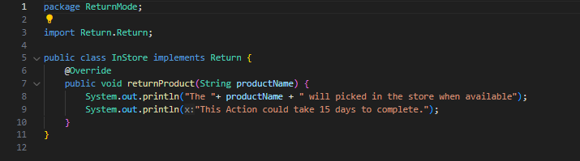
<h6 align = "center">Figura 12: Código pegar na loja troca/devolução Fonte: Bruno Seiji</h6>

#### Strategy MailDeliver

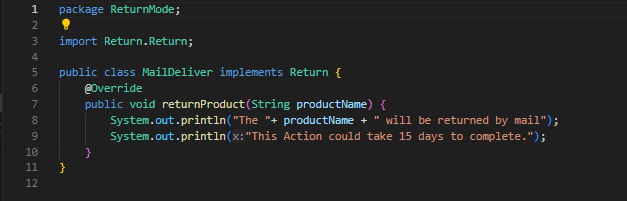
<h6 align = "center">Figura 13: Código Entrega por correio troca/devolução Fonte: Bruno Seiji</h6>

#### Process Return

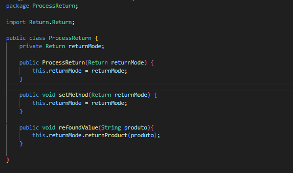
<h6 align = "center">Figura 13: Código Entrega por correio troca/devolução Fonte: Bruno Seiji</h6>

## Referências

> [1] Refactoring Guru. **Strategy**. Disponível em: https://refactoring.guru/design-patterns/strategy **Acesso em:** 29 nov. 2023.

> [2] **Arquitetura e Desenho de Software - Aula GoFs Comportamentais**. Material de apoio em slides. Milene Serrano.

| Versão | Alteração |  Responsável  | Revisor | Data de realização | Data de revisão |
| :------: | :---: | :-----: | :----: | :----: | :-----: |
| 1.0    | Criação do documento e diagrama/código reembolso | Guilherme Lima | Bruno Seiji | 01/12/2023| 01/12/2023 |
| 1.1    | Criação diagrama e código devolução              | Bruno Seiji    |             | 01/12/2023| 01/12/2023 |