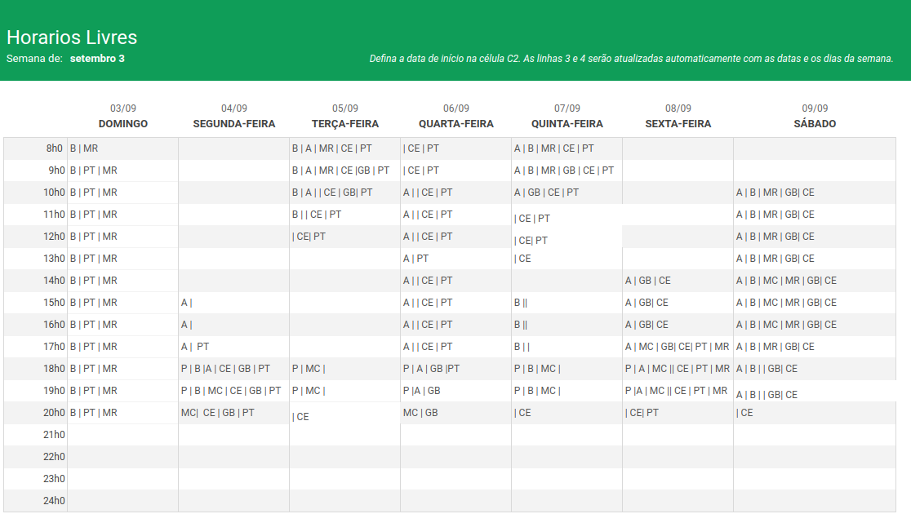

# Reuniões da equipe

## 1. Introdução

Este documento visa agrupar as informações referentes às reuniões realizadas pelo grupo, contendo tanto o Mapa de Calor da equipe, pelo qual foi possível determinar datas para reuniões, quanto as atas das mesmas.

**Obs**: este documento será atualizado conforme o decorrer da disciplina

## 2. Mapa de Calor

Para estabelecermos os horários para nossas reuniões de planejamento de cada Sprint, elaboramos um Mapa de Calor a fim de identificar os momentos da semana nos quais a maioria ou todos os membros da equipe estivessem disponíveis. 

O referido mapa pode ser visto a seguir. Cada sigla presente na tabela de horários se refere aos integrantes do grupo em seus devidos horários de disponibilidade.

<h6 align = "center">Figura 1: mapa de calor da equipe</h6>

### 2.1. Reuniões

Com o Mapa de Calor devidamente preenchido, é possível constatar que os dias de Segundas e Sextas-feiras, das 18h às 20h, e Sábados de 14h às 16h, emergem como os horários mais propícios para agendamento das reuniões, visto que são horários cuja maior parte dos integrantes se encontram disponíveis. Desta forma, buscaremos seguir esse princípio.

É importante ressaltar que isso não implica necessariamente que todas as reuniões serão agendadas sistematicamente nos mesmos dias da semana e horários. Considerando o alto envolvimento dos integrantes concomitantemente com outras disciplinas, e até mesmo com outros tipos de atividades, além de imprevistos, estabelecer uma data fixa de reuniões poderia comprometer eventuais encontros, por conta da indisponibilidade de alguns. Por conta disso, no quesito das reuniões, o grupo se torna mais flexível, buscando se adaptar de forma mais eficaz às particularidades de cada integrante, mas ainda assim, visando fortemente manter o compromisso de ao menos uma reunião semanal.

## 3. Atas de Reunião

| Reunião | Data  | Horário | Duração | Local | Participantes | Pontos discutidos |
|:------- | :---: | :-----: | :-----:  | :---: | :-----------: | :----------: |
| 1   | 13/09/2023 | 19:00 | 1h 30 min | Discord | TODOS | Brainstorming;   Definição de metodologia de trabalho;   Divisão das tarefas |
| 2   | 25/09/2023 | 14:00 | 60 min | Discord | TODOS | Correções na documentação;   Políticas de commits, branches e issues;   Atualização do Kanban;   Documentação do Backlog e das Sprints |
| 3   | 26/09/2023 | 20:00 | 60 min | Discord | TODOS | Feedback da 1a entrega;   Melhorias na dinâmica da equipe;   Divisão das tarefas para a 2a entrega;   Participação bilateral dos integrantes;   Definição das políticas de trabalho |
| 4   | 27/11/2023 | 20:00 | 60 min | Discord | TODOS, exceto Guilherme Brito e Pedro Torreão | Discussões sobre as correções e listagem das tarefas a serrem feitas;   Distribuição das tarefas;   Criação das novas issues |
| 5   | 29/11/2023 | 20:00 | 40 min | Discord | Guilherme Peixoto, Matheus Costa, Alex Gabriel, Matheus Raphael, Gabriel de Souza | Atualização do andamento das tarefas |
| 6   | 30/11/2023 | 16:30 | 4h | Discord | TODOS, exceto Guilherme Brito e Pedro Torreão | Atualização do andamento das tarefas (para quem não esteve no dia anterior);   Continuação das tarefas para a entrega final |

## Versionamento

| Versão |     Alteração     |  Responsável   | Revisor | Data de realização | Data de revisão |
| :----: | :---------------: | :------------: | :-----: | :----------------: | :-------------: |
|  1.0   | Criando documento | Carlos Eduardo | Matheus Costa | 26/09        |    27/09        |
|  1.1   | adição da Reunião 3  | Carlos Eduardo | Matheus Costa | 27/09        |     27/09       |
|  2.0   | Atas em formato de tabela  | Matheus Costa | Bruno Seiji | 27/09 |  28/09 |
|  2.1   | Atualização das últimas reuniões  | Matheus Costa | Alex Gabriel | 30/11 | 30/11 |
